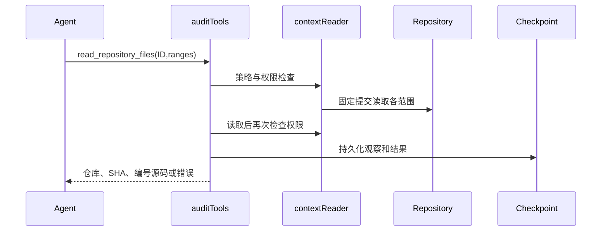

# PR审计优化技术设计

状态：Proposed；输入为用户2026-10-06确认的R3。分支codex/audit-workbench-optimization。既有SQLite/Eino/React边界保持；不得把新工具名称当成分析证明。

## 工作流与可维护性门槛

P10迭代进入P6契约与P7实现。已具备确认需求、现有界面和组件、固定证据、授权及恢复测试。允许先实施跨仓库批量读取切片，其余切片在对应契约细化后实施。默认沿用已有组件及屏幕状态，包含加载、空、失败、权限和冲突。无需新增Figma资产。

维护风险medium：agent_investigation.go工具注册与context_repository_tools.go授权读取需协作；文件均小于800行。新批量行为放独立文件，复用contextReader，避免重复授权实现。允许narrow_fix/独立增量，不做旧引擎广泛重构。现有context_repository_tools_test.go为权限回归基础。

## 首个切片：授权上下文批量读取

新增Agent工具read_repository_files，限同一个已枚举上下文仓库，固定SHA，1–8个范围。每个范围使用既有readArgs的path/start/end，禁止base=true（上下文只有一个固定提交）；输出沿用toolOutput，不新增HTTP路由或数据库表。每个片段带文件标题及编号源码，整体最多16000字节。超限或任何子项失败整批不返回部分源码；调用者缩小范围后重试，不自动重试。

| 对象 | 字段 | 类型/默认 | 校验及所有者 |
| --- | --- | --- | --- |
| contextBatchArgs（新增） | repository_id | int，必填 | auditTools核查策略ID、SHA和授权 |
| contextBatchArgs | files | []readArgs，必填 | 1–8项，各项沿用路径与行范围检查；base必须false |
| toolOutput（已有） | repository_id/base_sha/head_sha/observation_id | 既有类型 | 外层invoke产生一条持久化观察；SHA必须为对应上下文提交 |
| toolOutput | text/more/error/evidence_eligible | 既有类型 | 保持已有观察资格机制；部分范围不伪装完整读取 |

对象生命周期：每次审计初始化contextReaders；同一仓库reader的源码缓存仅供此固定快照使用，审计结束释放。批量调用使用同一授权前后检查包围全部读取；revocation后不返回缓存源码。内层rawOnly不额外消费全局工具预算，外层调用消费一次并保留检查点失败门槛。不得生成未持久化的子观察ID。

失败：未知仓库、策略SHA不匹配、撤权、缺失对象、取消、范围/输出超限均返回工具错误；不得透出远端敏感错误。返回More继续采用既有覆盖跟踪，并要求调用者后续单文件补全；没有下一游标的部分批量结果不能被解释为完整仓库覆盖。

兼容：新增工具，不修改已有工具调用。改变模型可用工具需更新策略版本，旧运行记录仍可读，不能将旧策略运行恢复成新策略。无需DB迁移；回滚代码恢复旧工具集，不删除历史轨迹。日志不含凭据，已有轨迹访问控制继续生效。

## 全部后续切片契约约束

PR归因与风险链：Finding新增可选变更原因与结构化链路，历史空值显示未记录。新策略要求风险解释BASE/HEAD差异；源码锚点验证与因果判断分别记录，不将文本声明升级为程序证明。每条边引用已持久化观察；跨仓库边需双方事实，不确定边单独展示。

知识与入口：从diff及相关路径生成有界检查建议；知识内容独立编写、按风险选择，不能充当证据。入口侦察消费共享工具/模型预算，交接只传可追溯事实及待查问题，保持发送前检查点。

复核：Review新增revision，旧记录迁移为1，无记录视为0；写入要求expected_revision，以事务条件更新检测冲突，冲突HTTP409，缺少条件HTTP400。前端保留草稿，刷新最新值后由用户明确重提；读取兼容，旧无条件写入调用方须迁移。

轻量状态：新增授权状态读取，版本覆盖报告、轨迹、复核、重试与评论状态；客户端版本相同不拉全量。每次检查权限，旧详情接口保留；失败可回退完整读取。具体版本事务一致性在该切片设计中细化。

SARIF：只导出授权、已保存位置及风险证据；BASE与HEAD及跨仓库URI分开。未核实链路写属性，不冒充已证明codeFlows；原报告覆盖说明保留，不上传外部平台。

评测：多语言及跨仓库PR引入/修复对，增加无关历史缺陷负例；标签不进入模型上下文。分别报告PR归因、定位、反证、误报漏报、未完成、token及工具成本。没有真实运行不得声称质量提升。

其余数据字段、接口与恢复细节在对应切片开工前补齐；本设计首切片可执行，不代表全部设计或目标完成。
