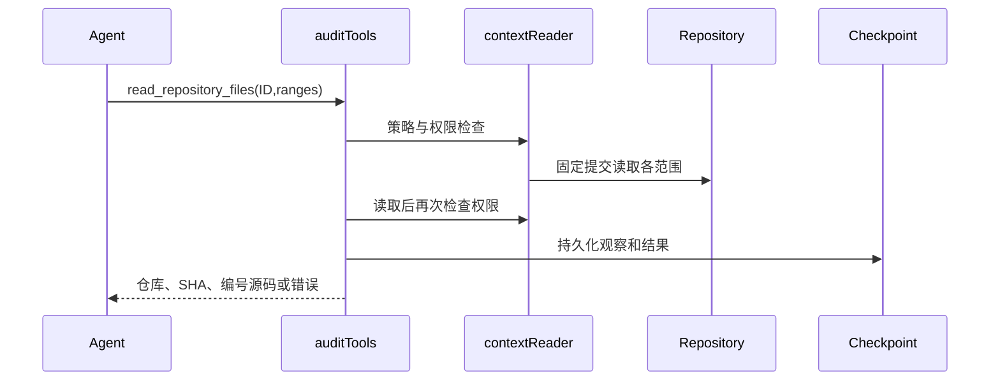

# PR审计优化技术设计

状态：Proposed；输入为用户2026-10-06确认的R3。分支codex/audit-workbench-optimization。既有SQLite/Eino/React边界保持；不得把新工具名称当成分析证明。

## 工作流与可维护性门槛

P10迭代进入P6契约与P7实现。已具备确认需求、现有界面和组件、固定证据、授权及恢复测试。允许先实施跨仓库批量读取切片，其余切片在对应契约细化后实施。默认沿用已有组件及屏幕状态，包含加载、空、失败、权限和冲突。无需新增Figma资产。

维护风险medium：agent_investigation.go工具注册与context_repository_tools.go授权读取需协作；文件均小于800行。新批量行为放独立文件，复用contextReader，避免重复授权实现。允许narrow_fix/独立增量，不做旧引擎广泛重构。现有context_repository_tools_test.go为权限回归基础。

## 首个切片：授权上下文批量读取

新增Agent工具read_repository_files，限同一个已枚举上下文仓库，固定SHA，1–8个范围。每个范围使用既有readArgs的path/start/end，禁止base=true（上下文只有一个固定提交）；输出沿用toolOutput，不新增HTTP路由或数据库表。每个片段带文件标题及编号源码，整体最多16000字节。超限或任何子项失败整批不返回部分源码；调用者缩小范围后重试，不自动重试。

| 对象 | 字段 | 类型/默认 | 校验及所有者 |
| --- | --- | --- | --- |
| contextBatchArgs（新增） | repository_id | int，必填 | auditTools核查策略ID、SHA和授权 |
| contextBatchArgs | files | []readArgs，必填 | 1–8项，各项沿用路径与行范围检查；base必须false |
| toolOutput（已有） | repository_id/base_sha/head_sha/observation_id | 既有类型 | 外层invoke产生一条持久化观察；SHA必须为对应上下文提交 |
| toolOutput | text/more/error/evidence_eligible | 既有类型 | 保持已有观察资格机制；部分范围不伪装完整读取 |

对象生命周期：每次审计初始化contextReaders；同一仓库reader的源码缓存仅供此固定快照使用，审计结束释放。批量调用使用同一授权前后检查包围全部读取；revocation后不返回缓存源码。内层rawOnly不额外消费全局工具预算，外层调用消费一次并保留检查点失败门槛。不得生成未持久化的子观察ID。

失败：未知仓库、策略SHA不匹配、撤权、缺失对象、取消、范围/输出超限均返回工具错误；不得透出远端敏感错误。返回More继续采用既有覆盖跟踪，并要求调用者后续单文件补全；没有下一游标的部分批量结果不能被解释为完整仓库覆盖。

兼容：新增工具，不修改已有工具调用。改变模型可用工具需更新策略版本，旧运行记录仍可读，不能将旧策略运行恢复成新策略。无需DB迁移；回滚代码恢复旧工具集，不删除历史轨迹。日志不含凭据，已有轨迹访问控制继续生效。

## 全部后续切片契约约束

PR归因与风险链：Finding新增可选变更原因与结构化链路，历史空值显示未记录。新策略要求风险解释BASE/HEAD差异；源码锚点验证与因果判断分别记录，不将文本声明升级为程序证明。每条边引用已持久化观察；跨仓库边需双方事实，不确定边单独展示。

知识与入口：从diff及相关路径生成有界检查建议；知识内容独立编写、按风险选择，不能充当证据。入口侦察消费共享工具/模型预算，交接只传可追溯事实及待查问题，保持发送前检查点。

复核：Review新增revision，旧记录迁移为1，无记录视为0；写入要求expected_revision，以事务条件更新检测冲突，冲突HTTP409，缺少条件HTTP400。前端保留草稿，刷新最新值后由用户明确重提；读取兼容，旧无条件写入调用方须迁移。

轻量状态：新增授权状态读取，版本覆盖报告、轨迹、复核、重试与评论状态；客户端版本相同不拉全量。每次检查权限，旧详情接口保留；失败可回退完整读取。具体版本事务一致性在该切片设计中细化。

SARIF：只导出授权、已保存位置及风险证据；BASE与HEAD及跨仓库URI分开。未核实链路写属性，不冒充已证明codeFlows；原报告覆盖说明保留，不上传外部平台。

评测：多语言及跨仓库PR引入/修复对，增加无关历史缺陷负例；标签不进入模型上下文。分别报告PR归因、定位、反证、误报漏报、未完成、token及工具成本。没有真实运行不得声称质量提升。

其余数据字段、接口与恢复细节在对应切片开工前补齐；本设计首切片可执行，不代表全部设计或目标完成。

## 切片2契约：按需风险检查知识

新增get_risk_checklist(category)只接受access_control、tenant_isolation、business_state、concurrency、injection五个固定键。内置内容由本项目独立编写，无外部加载、执行或网络请求。输出沿用toolOutput的text/observation_id，evidence_eligible恒false，不加入isSourceTool；不能链接为调查证据。未知类别或取消返回错误，调用消费既有一次工具预算和检查点。读取工具过滤允许此知识工具，但复核不能把它当来源观察。无需DB迁移；工具和提示变更提升策略版本。

Agent按PR差异选择相关检查，先定位受影响入口或契约，在已有record_hypothesis登记带源码观察的事实及待查问题，比较BASE/HEAD保护和后果。不得对所有文件执行全仓扫描或仅凭危险函数上报；没有相关风险可不加载清单。所有未证实关联保留next_steps和覆盖限制。知识本身不计入源码覆盖。

验证：工具注册/允许类别/取消/预算、非证据资格及调查拒绝知识观察；提示包含PR因果、未知关系和知识边界；回归主调查及独立复核。模型质量需要实际成对评测，本切片测试只证明契约。

## 切片3A：结构化PR调查上下文

Investigation新增可选pr_context（PRInvestigationContext），包含change_summary、before、after（各非空、最多800字符）、entry_points与guards（最多8项）、unresolved_edges（最多8项）。入口和保护事实为InvestigationFact：statement（非空<=500字符）、observation_ids（1–8个已成功的源码观察）。未核实关系为字符串（非空<=500字符），不能冒充证据事实。结构化事实的观察必须属于该调查的observation_ids或counter_observation_ids，知识及枚举ID被拒绝。整个调查继续受8000字节限制。

这些字段是模型的可追溯静态陈述，不是自动验证的调用图。新增Finding.pr_context为服务端派生：acceptFinding从关联调查复制，忽略模型自行提交的pr_context，深拷贝后与发现一起持久化；后续调查更新不能静默改写已接受发现。没有上下文的历史调查/报告保持可读，明确显示未记录；不以兼容旧数据伪造完整性。

登记/更新校验失败不改旧ledger，成功经现有检查点保存。记录入口未知时用unresolved_edges，不强制填假的entry_points。主提示要求重要PR风险假设填写结构化上下文；真实模型遵循度需质量评测，不凭schema声称召回改善。策略提升v17，布局和接口展示另切片跟进。验证大小、非法观察、知识ID、调查链接、深拷贝及历史空值。

### 切片3A界面契约

新PRInvestigationPanel复用于发现和调查记录，显示change_summary、BASE/HEAD两项、带ObservationLinks的入口/防护事实、单独未核实关系列表。使用原生details/summary键盘开合与既有样式，不引入图形库。历史pr_context缺失显示“未记录结构化PR影响”，不显示为无风险；数组空值明确显示未记录。内容由React文本渲染，不执行HTML。加载、错误、权限状态沿用运行详情资源边界；该面板不新增数据请求或写权限。展示为静态陈述可供核查，不标记形式化证明。响应式继承现有panel与dl；验证类型检查、构建，实际渲染证据另补。
