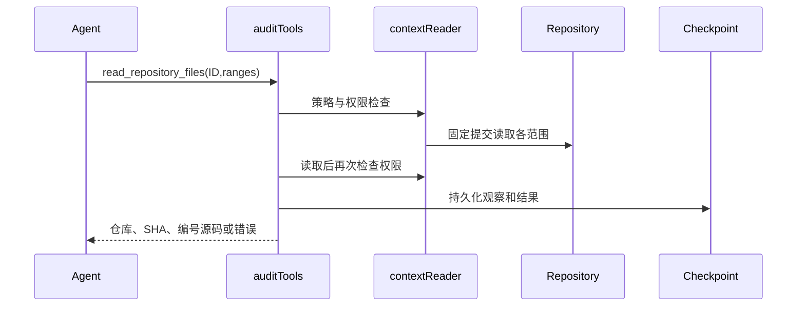

# PR审计优化技术设计

状态：Proposed；输入为用户2026-10-06确认的R3。分支codex/audit-workbench-optimization。既有SQLite/Eino/React边界保持；不得把新工具名称当成分析证明。

## 工作流与可维护性门槛

P10迭代进入P6契约与P7实现。已具备确认需求、现有界面和组件、固定证据、授权及恢复测试。允许先实施跨仓库批量读取切片，其余切片在对应契约细化后实施。默认沿用已有组件及屏幕状态，包含加载、空、失败、权限和冲突。无需新增Figma资产。

维护风险medium：agent_investigation.go工具注册与context_repository_tools.go授权读取需协作；文件均小于800行。新批量行为放独立文件，复用contextReader，避免重复授权实现。允许narrow_fix/独立增量，不做旧引擎广泛重构。现有context_repository_tools_test.go为权限回归基础。

## 首个切片：授权上下文批量读取

新增Agent工具read_repository_files，限同一个已枚举上下文仓库，固定SHA，1–8个范围。每个范围使用既有readArgs的path/start/end，禁止base=true（上下文只有一个固定提交）；输出沿用toolOutput，不新增HTTP路由或数据库表。每个片段带文件标题及编号源码，整体最多16000字节。超限或任何子项失败整批不返回部分源码；调用者缩小范围后重试，不自动重试。

| 对象 | 字段 | 类型/默认 | 校验及所有者 |
| --- | --- | --- | --- |
| contextBatchArgs（新增） | repository_id | int，必填 | auditTools核查策略ID、SHA和授权 |
| contextBatchArgs | files | []readArgs，必填 | 1–8项，各项沿用路径与行范围检查；base必须false |
| toolOutput（已有） | repository_id/base_sha/head_sha/observation_id | 既有类型 | 外层invoke产生一条持久化观察；SHA必须为对应上下文提交 |
| toolOutput | text/more/error/evidence_eligible | 既有类型 | 保持已有观察资格机制；部分范围不伪装完整读取 |

对象生命周期：每次审计初始化contextReaders；同一仓库reader的源码缓存仅供此固定快照使用，审计结束释放。批量调用使用同一授权前后检查包围全部读取；revocation后不返回缓存源码。内层rawOnly不额外消费全局工具预算，外层调用消费一次并保留检查点失败门槛。不得生成未持久化的子观察ID。

失败：未知仓库、策略SHA不匹配、撤权、缺失对象、取消、范围/输出超限均返回工具错误；不得透出远端敏感错误。返回More继续采用既有覆盖跟踪，并要求调用者后续单文件补全；没有下一游标的部分批量结果不能被解释为完整仓库覆盖。

兼容：新增工具，不修改已有工具调用。改变模型可用工具需更新策略版本，旧运行记录仍可读，不能将旧策略运行恢复成新策略。无需DB迁移；回滚代码恢复旧工具集，不删除历史轨迹。日志不含凭据，已有轨迹访问控制继续生效。

## 全部后续切片契约约束

PR归因与风险链：Finding新增可选变更原因与结构化链路，历史空值显示未记录。新策略要求风险解释BASE/HEAD差异；源码锚点验证与因果判断分别记录，不将文本声明升级为程序证明。每条边引用已持久化观察；跨仓库边需双方事实，不确定边单独展示。

知识与入口：从diff及相关路径生成有界检查建议；知识内容独立编写、按风险选择，不能充当证据。入口侦察消费共享工具/模型预算，交接只传可追溯事实及待查问题，保持发送前检查点。

复核：Review新增revision，旧记录迁移为1，无记录视为0；写入要求expected_revision，以事务条件更新检测冲突，冲突HTTP409，缺少条件HTTP400。前端保留草稿，刷新最新值后由用户明确重提；读取兼容，旧无条件写入调用方须迁移。

轻量状态：新增授权状态读取，版本覆盖报告、轨迹、复核、重试与评论状态；客户端版本相同不拉全量。每次检查权限，旧详情接口保留；失败可回退完整读取。具体版本事务一致性在该切片设计中细化。

SARIF：只导出授权、已保存位置及风险证据；BASE与HEAD及跨仓库URI分开。未核实链路写属性，不冒充已证明codeFlows；原报告覆盖说明保留，不上传外部平台。

评测：多语言及跨仓库PR引入/修复对，增加无关历史缺陷负例；标签不进入模型上下文。分别报告PR归因、定位、反证、误报漏报、未完成、token及工具成本。没有真实运行不得声称质量提升。

其余数据字段、接口与恢复细节在对应切片开工前补齐；本设计首切片可执行，不代表全部设计或目标完成。

## 切片2契约：按需风险检查知识

新增get_risk_checklist(category)只接受access_control、tenant_isolation、business_state、concurrency、injection五个固定键。内置内容由本项目独立编写，无外部加载、执行或网络请求。输出沿用toolOutput的text/observation_id，evidence_eligible恒false，不加入isSourceTool；不能链接为调查证据。未知类别或取消返回错误，调用消费既有一次工具预算和检查点。读取工具过滤允许此知识工具，但复核不能把它当来源观察。无需DB迁移；工具和提示变更提升策略版本。

Agent按PR差异选择相关检查，先定位受影响入口或契约，在已有record_hypothesis登记带源码观察的事实及待查问题，比较BASE/HEAD保护和后果。不得对所有文件执行全仓扫描或仅凭危险函数上报；没有相关风险可不加载清单。所有未证实关联保留next_steps和覆盖限制。知识本身不计入源码覆盖。

验证：工具注册/允许类别/取消/预算、非证据资格及调查拒绝知识观察；提示包含PR因果、未知关系和知识边界；回归主调查及独立复核。模型质量需要实际成对评测，本切片测试只证明契约。

## 切片3A：结构化PR调查上下文

Investigation新增可选pr_context（PRInvestigationContext），包含change_summary、before、after（各非空、最多800字符）、entry_points与guards（最多8项）、unresolved_edges（最多8项）。入口和保护事实为InvestigationFact：statement（非空<=500字符）、observation_ids（1–8个已成功的源码观察）。未核实关系为字符串（非空<=500字符），不能冒充证据事实。结构化事实的观察必须属于该调查的observation_ids或counter_observation_ids，知识及枚举ID被拒绝。整个调查继续受8000字节限制。

这些字段是模型的可追溯静态陈述，不是自动验证的调用图。新增Finding.pr_context为服务端派生：acceptFinding从关联调查复制，忽略模型自行提交的pr_context，深拷贝后与发现一起持久化；后续调查更新不能静默改写已接受发现。没有上下文的历史调查/报告保持可读，明确显示未记录；不以兼容旧数据伪造完整性。

登记/更新校验失败不改旧ledger，成功经现有检查点保存。记录入口未知时用unresolved_edges，不强制填假的entry_points。主提示要求重要PR风险假设填写结构化上下文；真实模型遵循度需质量评测，不凭schema声称召回改善。策略提升v17，布局和接口展示另切片跟进。验证大小、非法观察、知识ID、调查链接、深拷贝及历史空值。

### 切片3A界面契约

新PRInvestigationPanel复用于发现和调查记录，显示change_summary、BASE/HEAD两项、带ObservationLinks的入口/防护事实、单独未核实关系列表。使用原生details/summary键盘开合与既有样式，不引入图形库。历史pr_context缺失显示“未记录结构化PR影响”，不显示为无风险；数组空值明确显示未记录。内容由React文本渲染，不执行HTML。加载、错误、权限状态沿用运行详情资源边界；该面板不新增数据请求或写权限。展示为静态陈述可供核查，不标记形式化证明。响应式继承现有panel与dl；验证类型检查、构建，实际渲染证据另补。

## 切片4：复核版本冲突与草稿

Review新增revision（int64，读取只读，初始记录1）、expected_revision（可选指针int64，写入必填，0代表从未复核）。SQLite platform_reviews增列revision NOT NULL DEFAULT 1，幂等迁移，不修改原状态/历史/评论队列。事务先授权及核查发现存在，再要求非负expected_revision。首次写入INSERT ... ON CONFLICT DO NOTHING，更新WHERE revision=expected，revision+1；影响行数0返回ErrReviewConflict，事务回滚不追加历史/事件或调度评论。缺少版本ErrReviewRevision返回400；冲突409；权限先于冲突判断，避免信息泄漏。所有Store调用同样要求版本条件，测试fixture读取当前版本后显式传入，不增加生产无条件写入后门。

HTTP继续原PUT路径，读取Review带revision。前端记录读取基准版本，未编辑表单跟随远端；有草稿且远端变更时保留草稿、禁用提交，提供加载最新决定或保留草稿并采用新基准的明确操作。409刷新资源并显示冲突，不自动覆盖或重发。提交中禁止编辑及重复提交，成功后刷新最新状态。历史无revision字段客户端需刷新新版；旧API写入缺少expected_revision明确400。

验证：首次并发只成功一个，陈旧更新不改状态/历史/队列，正确版本递增，权限优先，重复迁移保留数据；API缺失/过期/有效版本；浏览器草稿与刷新行为。回滚旧服务会失去版本约束，不能在多人复核期间无准备降级；数据库增列保留兼容读取，部署仍未授权。

## 切片5A：固定Git文件清单缓存

GitRepository增加私有清单缓存，每实例最多2个提交清单，总估算容量8MiB（路径字节及slice/string开销），按Directory与完整SHA隔离，FIFO淘汰。paths先验证取消和完整提交，再串行加载同键；失败不缓存、返回切片复制，调用者不能改共享状态。超出单项容量明确报错，不以截断冒充完整清单。对象生命周期随准备仓库实例释放，无全局缓存/后台任务/磁盘索引。固定对象无需TTL；Directory变更不能复用旧清单。

该缓存仅降低Git ls-tree读取，不缓存访问权限；上下文工具的读取前后授权继续每次执行。BASE和HEAD按真实SHA分开，相同SHA允许复用。取消包括命中缓存时必须拒绝。上限独立于已有源码缓存，文档说明额外内存；不提升策略版本（工具契约和输出不变）。验证实际Git子进程计数、并发同提交只读一次、不同提交/仓库隔离、返回值不可修改缓存、淘汰/超限与取消。性能结论只限实测操作次数，不外推端到端速度。

## 切片5B：轻量详情版本查询

新增GET /api/v1/runs/:id/status，返回detail_version、status、queue_wait，无result/trace/history。每次沿用requireRun授权，取消/撤权返回既有错误。完整详情新增detail_version，在读取报告之前取得版本：若读取期间变化，下次轮询会保守刷新，不将较早报告标成较新版本。

SQLite platform_detail_versions(project_id PRIMARY KEY,revision NOT NULL)按项目累计。runs的INSERT/UPDATE/DELETE及reviews/comment_delivery/review_history/occurrences/association_history/run_context_repositories对应写入通过触发器同事务递增所属项目。projects/members/users/context配置变动递增全局project_id=0，避免缓存权限/相关历史可见性变化。版本计算加入run ID、user ID、角色、项目及全局计数、评论开关、队列等待原因/时间。队列状态每次用轻量Run属性重新计算，不能依赖DB变化发现时间流逝。计数只用于摘要，输出SHA256不暴露计数或其他项目资料。

首次/显式刷新始终完整读取；活跃任务每2秒先检查轻量版本，相同不加载完整详情，不同则load。状态请求不重叠，切换任务或组件销毁取消，过时响应不触发另一任务刷新。失败触发既有完整读取恢复；401/403/404完整读取清空旧内容。项目内其他任务变化可保守失效，暂不声称所有并发负载均有相同收益。旧详情调用方不受影响；触发器迁移幂等，增加计数不修改历史数据。

测试：版本稳定、同长度JSON修改失效、复核/评论/重试及历史变化、角色撤销、无源码轻量响应、时间相关queue_wait、迁移幂等及前端真实轮询次数。没有测量字节与调用前不报告传输收益数字。

## 切片6：授权SARIF 2.1.0导出

新增GET /api/v1/runs/:id/sarif，沿用完整快照viewer权限，读取后再次授权，返回application/sarif+json附件，no-store；不上传第三方、不读取/执行新源码。纯BuildSARIF(Run,[]Review)模块生成tool.driver、规则、results、invocations和properties。规则按风险类型稳定排序与ID；severity映射high/error、medium/warning、low/note。fingerprint仅保留已有值，不伪造跨版本身份。

位置用仓库相对URI及originalUriBaseIds区分BASE、HEAD和授权关联仓库固定SHA；基址aimangebot://repository/<id>/commit/<sha>/仅为快照标识，不是可执行下载地址。删除锚点保持BASE，不强行移到HEAD；Git元数据位置不生成line0 region。已保存时序引用作为relatedLocations，未知/非法来源忽略并记录数量；所有推断步骤及PR未知关系保存在properties，不生成codeFlows，因为当前没有运行/程序分析证明完整路径。

结果properties包含验证状态、触发条件、修复建议、观察ID与PR上下文；false_positive人工决定可导出external suppression，空理由用明确默认说明。运行properties保留状态、固定提交、策略、覆盖缺口；executionSuccessful仅表示审计运行完成，不表示无漏洞。历史或缺失验证明确unverified；默认无runtime reproduction。

UI在详情增加下载按钮，通过既有api权限错误处理，JSON序列化为Blob后本地下载，立即释放object URL；忙时禁用，失败显示错误。加载/空/权限状态仍沿用详情，不新增上传。验证官方JSON schema、BASE删除、元数据、跨仓库与不确定关系、权限撤销/未登录/导出错误；不宣称特定托管平台原生上传兼容。

## 发现工作台切片：筛选与导航契约

Workflow Gate Report：用户要求优化审计复核体验；当前 P7，REQ007/AC007 已确认。复用现有 Finding/Review 类型和页面样式，客户端只筛选已授权加载的结果，无 API 新字段。空报告沿用原提示，筛选零匹配另给清空操作；默认全部，不隐去候选/历史未核实发现。控件有可访问名称、结果数 live 提示、窄屏换行。无新增 Figma 资产。上游产品契约已存在，筛选具体字段作为实现假设可安全推断，允许实现。

支持文字（标题/路径/描述/风险类型）、严重度、人工复核、独立静态复核筛选；组合 AND。导航只列当前匹配项，跳转对应卡片，不将独立复核误称运行验证。计数展示匹配/总数，未知字段值仍作为可选项提供。过滤时卡片保持挂载并 hidden，以保留未提交草稿、冲突状态及运行中的保存操作；不分页、不以列表位置作为身份。切换 run 用 key 重建筛选状态。

Maintainability Gate Report：run-detail.tsx 586 行，页面组合与卡片复核两职责，风险 medium；新增行为放 finding-workbench.tsx，原页面仅薄委托，选 adapter_extraction，不进行广泛重构。复核草稿保留必须通过真实组件交互验证，类型检查/build 必需。隐藏保留组件不是虚拟化性能优化，不声称减少初始渲染成本。

## 无进展读取保护契约

P7/REQ006：固定快照只读工具对完全相同参数的成功读取允许三次，第四次不再读取并返回明确无进展错误及已有证据 ID。请求不同范围、分页、BASE/HEAD、关联仓库或查询条件不合并；失败不计为成功，避免封死暂时性失败的恢复。只对来源工具及清单/概览读取生效，不限制调查更新、报告构建和提交发现。独立复核拥有独立工具实例与计数。保护失败保留 trace/checkpoint/pending，并按既有覆盖不足路径表达，不假称完整审计。不会返回曾经缓存的源码绕过当前授权。此机制限制重复数据读取，模型仍受既有轮次和工具总预算限制；不能宣称自动判断语义无进展。

维护检查：agent_tools.go 低于800行，但已有读取、预算及记录职责；新重复状态逻辑独立模块，invoke 仅薄委托。产品/接口沿用 toolOutput.Error，无新UI。允许 narrow feature，使用定向工具测试、race、全量 Go 检验，并递增策略版本避免旧任务按新规则重试。

## PR 风险链：逐边事实契约

REQ003/005 的下一切片在现有 PRContext 增加可选 before_observation_ids/after_observation_ids、impact（风险结果事实）、counterexamples（已检查反例事实）与 relationships（from/to/relation、certainty=cited|inferred、observation_ids）。每项均引用当前调查已验证的源码观察，两个快照的来源分别链接；跨文件/跨仓库边使用来源观察识别固定仓库。cited 表示模型提供连接依据的静态陈述，服务端只验证来源归属，不能解释为调用语义已证明；inferred 明确为推测，未找到依据的关系放 unresolved_edges。旧 nil/空字段兼容，不强制伪造完整链。列表最多8项、边端点最多200字、关系最多500字、事实500字；沿用整体8000字节调查上限。保存/发现派生/压缩交接继续使用完整已验证 ledger，禁止 proposal 覆盖服务器派生上下文。

Workflow Gate：P7，已确认范围，扩展现有可选契约，无新服务端API，UI复用源码观察链接并分开呈现静态引用和推测；unknown/empty 明确显示。Maintainability Gate：两个小模块各单一职责，允许窄切片，不动大型 legacy 模块。验证：拒绝跨调查观察、未知确定性、无来源边、超长项；历史兼容、深复制、JSON保留及实际UI展示；递增审计策略。

## 跨仓库评测输入契约

P7/REQ011：在自建语料 case 中可选 context_repositories（最多8，每个 repository_id>=2且唯一、files最多100、单文件256KiB，仍受整个语料1MiB上限）。显式列出的样例仓库是评测授权边界，创建独立固定提交，无网络取仓库、不执行代码；源码观察按正常 contextSources/policy 校验。样例上下文与标签/判定理由分离，只把固定仓库事实传入模型；receipt 保存关联仓库 SHA。历史 Git 语料先不接受该字段，避免把样例与真实源码混为同一授权模型。缺省无上下文兼容已有11例。

维护门槛：评测入口/语料模块职责现有清楚，新增准备逻辑独立模块；不改变生产审计策略。校验全部路径/预算/ID后才能建上下文仓库，复用禁钩子确定性 Git 构造。同内容上下文 BASE/HEAD 提交允许空提交，内容不增加伪造说明文件。验证 corpus拒绝重复/主仓库ID/路径逃逸、固定SHA可复现、语料标签不进入仓库、实际 ContextSources读取固定内容；跨仓库正负对照质量单独实际模型运行。

## 评测反馈修正：可操作来源错误与逐项复核

P7/REQ004/006/012。来源拒绝行为保持，改为报出具体缺失/重复 ID 和修复指引：PRContext 的来源必须同时出现在当前提交的 investigation observation_ids/counter_observation_ids，先确保来源成功再补清单，不自动扩大证据归属。非来源观察拒绝明确要求 evidence_eligible=true，不能补出不存在的来源。独立复核增加逐项核对限制/后果：区分代码执行的限制和名字/惯例推断，不把单位名或类型当输入校验；附带结论无证据须列入limitations，核心风险依赖该结论时inconclusive。避免按新语料硬编码整数/Decimal规则。

维护门槛：小型验证模块，允许窄错误消息及提示契约更新；无需新API/UX，保留既有错误/限制展示。测试验证具体ID、修复后可接受、非来源仍拒绝且不改ledger、提示要求存在；策略v20，定向race与全量Go。模型效果仅另轮实际诊断，不以提示存在证明改进。

## 独立复核的关联仓库覆盖门槛

v20同配置跨仓库回归case-102出现误报：主调查及复核均未检查可用关联服务，按旧换算推测单位并给supported。不能用更长提示证明解决。新增服务端门槛：有显式固定context仓库时，supported必须引用每个已配置仓库至少一个本次成功固定源码观察（目录/清单不算）；缺任一仓库则保留主发现、将独立复核降为inconclusive，明确缺失仓库ID。related仓库由管理员任务配置显式选择；门槛保守，可能要求检查与特定发现无直接关系的仓库，预算不足就保持未完成，不伪称独立支持。

新增检查只保证已查看/引用，不证明源码内容与关系语义；rejected仍按真实反证校验，不把未看上下文自动当否定。原模型解释保留在标为未确认的Reason中（总长1000字内），limitations额外追加一条服务器覆盖说明，不删除原限制。当前模型输入限制仍8条，服务器说明最多再加1条。提示同步要求检查列出的固定上下文，策略v21。无新字段/DB/API。定向测试证明无上下文兼容、缺失自动降级、错误/旧快照不算、读取并引用完整上下文才保留supported；全量回归必需。真实效果下一轮保留同配置证据，旧误报不移除。

## 跨组来源交接切片契约

P7/AC003。现有组结果合并保留完整ledger和来源trace，但后续主调查仅收到manifest，综合阶段只收到findings，没有未完成investigations。下一切片为每组初始任务增加服务器组装的有界 prior_group_notes（最多12KiB JSON）。包含已结束组调查条目（带原观察ID、PRContext、NextSteps）、已发现风险的标识/改动定位，以及这些条目关联的成功源码工具参数定位（不复制源码输出）。来源说明只用于重新定位固定源码，evidence_eligible=false；下一组必须重新读取并使用其自身新观察ID，不能直接升级旧事实或引用旧ID提交finding。

超过预算省略完整条目而非截断JSON，携带 omitted 数量，并在父结果追加覆盖限制。任何关联仓库授权检查失败不传既有事实，明确交接不可用。不新增全仓库扫描、共享模型内部推理或把先前结果写入下一组canonical ledger。最终综合输入加入完整investigations（仍受原64KiB预算，超限保留失败说明），防止未完成链静默丢失。工作台继续展示原合并调查与工具来源，无新API。重用现有取消/模型预请求持久化；策略变更实施时递增。

维护门槛：grouped_agent.go约180行/agent.go中等单一Agent组装职责，新增projection独立group_handoff模块；仅薄委托，不广泛重构。验收测试：条目深复制无副作用，来源仅成功固定工具参数，遗漏有界可辨，授权失败无事实传递，后一组实际接收来源且旧ID不能作为新证据；checkpoint/synthesis不改finding置信。类型无需前端变化，定向race与Go全量。

## 归因反馈：先比较预期契约，不能假设BASE正确

P7/AC002/004/005。v21负对照102已读取源码仍将“相对旧值减少”误称损害。主调查及独立复核增加通用契约检验：识别来源支持的预期行为/不变量，选择明确输入，分别沿BASE/HEAD及固定下游契约推导可观察结果，再说明HEAD违反哪一契约。旧值不是规范，变化大小本身不证明风险；BASE可能已有错误，HEAD可能修复不兼容。预期行为缺失时记录未知，不能通过假设旧行为正确构造漏洞。使用源码事实或明确条件，不请求内部思维链、不执行代码、不针对金额或样例ID硬编码。

独立复核reason须提供有界事实对比或明确未知，不因主提案给出损害标题而沿用其结论。维护门槛：仅提示契约，小模块，无API/DB/UI新字段，策略v23。现有来源/复核回归与实际同配置4例检查；不将提示字面存在当语义测试。原轮次误报继续保留。

## v23执行反馈：有界调查与锚点修复提示

P7/AC006/012：v23 case-102八次提交超8000字节调查，case-103四次修正无效锚点/未关联来源后触发步骤预算。下一窄修复保持所有大小/来源/锚点门槛，错误给出实际序列化字节数、8000 UTF-8字节上限及精简重复源码/事实的指引；空claim与超长ID分别报错。record/update工具描述同步预算，建议少量核心事实，不增加token/step额度。finding来源错误指出具体ID与调查ID，指明先更新同一调查来源清单或改用已关联来源；锚点错误提醒HEAD新增或BASE删除，精确匹配错误提醒重新读取正确侧/行，不回显额外源码。无schema/DB/UI字段变化，策略v24；定向测试确保超限拒绝不更改ledger、修复到限内可保存、精确信息且来源门槛不放宽。实际模型质量另轮验证，原预算失败保留。

## 切片15：独立复核全文覆盖门槛

Workflow Gate Report：用户确认R3最佳实践优化；阶段P10反馈修正；后端证据契约窄修复。上游requirements AC006/011、既有FindingVerification API/组件与v24实际失败记录齐全。薄弱项为supported只判核心风险，全文无依据后果仍存在。允许实施，不需新增页面或重写风险叙述。验收：复核返回claim_coverage=full|partial|unknown；supported且非full由服务器降为inconclusive，保留原候选、原原因和限制，显式说明全文未获支持。rejected保持，来源/授权/锚点门槛不变；历史存储无该字段仍可读，但新的复核缺字段不能支持全文。该字段是模型的静态范围声明，不是语义证明。

Maintainability Gate Report：检视finding_verification.go110行（契约解析/验证）、verification_agent.go206行（独立阶段），现有定向SDK与来源验证测试覆盖；风险低，narrow_fix，无需先重构。不修改大型agent编排；解析枚举、覆盖投影各自原责任内。验证解析非法值/重复旧字段兼容、full/partial/unknown/缺失判定、来源锚点不放宽、拒绝不覆盖、完整SDK与Go回归。

契约：claim_coverage覆盖title、description、trigger及所有具体后果/示例，在已明确写出的条件下逐项检查；缺失运行时复现本身不必partial，但无证据交付/获利或未证实具体payload标partial，并列limitations。不会自动改写原finding、不会让模型写额外补丁或执行代码。server downgrade原因截断1000字符，追加一条服务器范围说明（与已有来源覆盖门槛同类，不冒充模型limitations）。策略v25，原UI已有inconclusive与limitations展示适用。

## 切片16：复核全文范围的可见性

Workflow Gate Report：P10反馈修正，R3 AC006/007及v25 API范围字段已落地；复用FindingCard/VerificationEvidence，无新后端接口。实现允许：主调查标签改为明确的主调查源码支持，partial/unknown全文范围在描述前显示静态证据提示，复核面板显示全文/部分/未知范围，历史无字段单列未声明，不篡改历史判定。加载/无记录继续原状态；已有拒绝/不足/失败保留；提示不是运行复现证明。不改变人工复核权限、草稿或筛选。

Maintainability Gate Report：run-detail.tsx现有单页组件组成、api.ts类型集聚，本切片只插入已提取VerificationNotice组件及可选类型字段；新逻辑保留在finding-verification.tsx，避免向详情页堆积判定。narrow_fix；无需广泛重构。验收真实组件显示partial提示优先于描述，full/历史/无记录有不同范围说明，窄宽360px和键盘导航无新增横向溢出，类型/构建通过。

## 切片17：主调查上下文预检与服务器覆盖记录

Workflow Gate Report：P10，AC002/003/011；实际验收203主阶段忽略下游、205误称可用契约不可检查，既有固定授权列表工具/trace/checkpoint接口齐全。实施允许：首次主模型请求前复用list_repositories进行授权预检，成功列表作为显式非源码导航进入任务，旧观察仍不能当证据；无关联源不增加调用或提示。预检耗一个工具调用，预算保持。取消/撤权/进度持久化失败不发送模型请求。工具聚合列表前后复核授权防止期间撤权；可用状态不作为后续读取授权替代。

主阶段结束后按成功、固定SHA、evidence_eligible源码trace记录每个配置源的实际读取状态：未读取只说明相关性未知，不说不存在/安全；不可用由预检记录，候选及原覆盖说明不删，独立复核后来读取不追溯把主调查标成已读。不推断仓库语义、不抓取目录自动全量审计。

Maintainability Gate Report：agent.go约330行只增加预检调用/覆盖投影调用，新实现独立context_navigation.go纯投影+工具复用；context_repository_tools.go约145行保留权限责任。低风险narrow_fix，无需大重构；测试首次SDK提示与模型请求前checkpoint、源码读取资格（失败/列表/旧SHA不算）、无源不改提示、撤权/取消不发模型、同配置来源完整保留。策略v26。此改动依据已见验收失败，corpus-acceptance-v1自此转回归，不再称当前策略隔离验收，后续补新验收版本。

## 切片18：服务器风险链记录缺口

Workflow Gate Report：P10，AC005/006/007；既有PRContext字段和UI空态已具备，v26实际结果虽有事实仍缺双方来源与逐边关系。实施允许：候选合并/校验后，由服务器逐finding检查结构化PR记录是否有before/after来源、逐边关系；没有不推断安全或完整，而加入coverage_notes。推测关系即使模型unresolved_edges为空仍提示未核实。无PRContext单列未记录，不自动创建关系、不从名称推断路径、不删除候选或改独立复核。UI已有coverage缺口面板使用同API，无新增契约。

Maintainability Gate Report：agent.go仅增加单调用，新纯投影pr_context_coverage.go及定向测试，低风险narrow_fix。验收missing/nil/partial/full/inferred、已有来源事实不替换、JSON独立支持不等同风险链完整，Go回归通过。metadata-only发现不自动要求运行路径关系，说明只用于line风险链；metadata仍要求PR前后事实来源。策略v27。同已见回归样例诊断不能称新隔离验收。

切片18回归修正：无PRContext但已经通过canonical Git metadata验证的发现，其evidence包含BASE/HEAD模式/对象，不额外要求重复结构化链（普通line候选继续显示缺口）。全量暴露group/HTTP/diagram旧测试默认无PRContext仍零覆盖不足的断言；这与新增明确记录契约冲突，改为精确验证服务器gap保留、HTTP为incomplete及图阶段不增加/删除该原因，原发现/评论/筛选断言不改。不是将真实源错配放宽为成功。

## 切片19：评测复用生产分组路径

Workflow Gate Report：P9验收工具，AC003/011；生产PlanAuditGroups/AuditGroups已有SDK与授权回归，评测CLI目前只调用单组Audit，不能证明真实多组行为。允许新增显式-grouped布尔选项（默认false，旧单组复现保留），metadata记录模式、恢复必须模式相同，grouped复用生产32KiB/24文件/8组规划、共享既有工具与token预算、原240秒，不自创分组。保存完整result.AuditGroups/trace/checkpoint与遗漏说明，不以进程0表示各组成功。使用明确已见机制的独立多组诊断语料，不称未见质量验收。

Maintainability Gate Report：cmd/audit-eval/main.go约300行，窄flag/metadata/调用分支，不移动平台编排、不新增运行代码能力。低风险narrow_fix；验收默认旧调用、grouped持久化模式、实际25文件输入生成两组、模型/预算/超时不变。CLI/平台已有构造器、分组边界/SDK测试复用，新增元数据模式测试，真实运行需人工检视两组状态/规范调查与来源，不只看计数。

## 切片20：当前组边界与覆盖说明稳定去重

Workflow Gate Report：P10反馈，v27真实两组scope错误/重复coverage已归档；现有分组计划/AgentConfig/coverage API可复用。允许内部CurrentGroup导航（ID/当前组文件，最多16KiB完整JSON），主提示说明总manifest仅导航、只有当前组diff可提交，先前规范finding不重复提交；可读取跨组来源但不能借旧观察授权新发现。普通单组不增加导航。锚点路径不在当前scope时错误明确本组边界，仍不放宽side/line/source校验。synthesis覆盖说明完全相同字符串去重，稳定保留首次顺序、不trim/合并近义/移除不同来源记录。不宣称自动避免语义重复调查。

Maintainability Gate Report：agent/grouped/synthesis约330/180/155行，新纯helper group_navigation.go，不添加大型全局状态。低风险narrow_fix；测试普通单组、16KiB完整导航、真实两组SDK第二组任务明确scope/不得重复、跨组路径拒绝、覆盖顺序与不同字符串保留。元数据scope验证不改，生产预算不改，策略v28。真实多组新轮验证仍需保留上一失败。

## 切片21：详情刷新失败的旧数据提示与最终状态QA

Workflow Gate Report：P9/P10，AC007/012。useResource已在500等可恢复失败保留成功数据、401/403/404清空，详情页目前仅显示原错误，旧快照可能被当最新状态。上游行为/API/共享ErrorBox已具备，允许窄UI修复：已有数据且刷新失败显示旧快照说明和可重试按钮，重试期间disabled；动作错误单独显示，不隐藏读取错误；初次加载重试disabled防重入。权限失败继续清空旧数据，无新端点/权限。

Maintainability Gate Report：详情页590行只组合共享ResourceRefreshFailure组件，原hook逻辑和写入动作不改，低风险narrow_fix。验收受控实际RunDetail加载/500失败旧数据/重试成功/403清空/无发现/队列/评论unknown、360px布局/键盘；类型/构建通过。受控fixture不是线上E2E，后台授权由现有路由回归覆盖。

## v37 显式记录错误纠正

新增非源码工具resolve_recording_errors，输入1–8对 failed_observation_id/corrected_observation_id。错误必须仍在当前pending，属于record_hypothesis/update_investigation/submit_finding；纠正必须为之后成功的同类产物记录、同主快照，trace和output编号一致。调查用非空相同local ID；提交用非空相同local candidate ID、同investigation_id、文件和风险type，避免另一产物成功隐式消除未提交候选。IDs必须来自实际trace，不使用模型描述证明恢复。所有对先验证，失败不清除任何pending；成功只清除指定旧错误，不改trace/ledger/finding/source，不解除其他错误或分页/计划/链路缺口。无ID失败无法自动归属，继续未解决。声明产物纠正是导航事实，不是命题语义证明。

纠正事件及输入/输出保留于独立tooltrace/checkpoint。该工具非source/evidence_eligible=false，独立复核与压缩只读工具列表排除它。保留原预算，每次调用计费/计步正常；策略v37，旧报告不改写。不会自动滤掉所有历史process错误。
