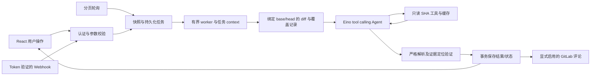

# AIMergeBot 产品化技术设计

日期：2026-10-04；状态：实施设计；输入：已确认 requirements.md。最终交付 main。

## 边界与现状

保留 Go/Gin、SQLite 和 GitLab 自托管形态。新增 internal/platform，按认证、存储、任务、仓库、Agent 和路由拆分；旧审计内核不继续增加复杂度。main.go 仅加载配置、构建服务、关闭资源。旧 HTML 被 React/TypeScript/Vite 应用替代；旧数据作为历史结果导入并标记缺少提交证据，不能伪造 SHA。

## 契约与数据

新 API 全部 /api/v1；错误为 {error: string}；列表为 {items,total,page,size}；分页 size 1–100。成员可读全部团队项目、启动/取消审计、复核发现；管理员额外管理用户及项目。单团队范围不构造虚假的项目级隔离。

|对象|新字段、类型与约束|生命周期/默认|
|---|---|---|
|User|id integer PK、username unique 3–64、password_hash bcrypt、role admin/member、disabled bool|管理员创建；禁止删除最后一个可用管理员；密码/禁用修改撤销会话|
|Session|token_hash unique、user_id FK、expires_at UTC|随机 32 字节 token，数据库仅存 SHA256；HttpOnly SameSite=Lax cookie，TLS 时 Secure，退出撤销；24h 过期|
|Project|id GitLab 数字 ID、name、enabled bool|管理员配置；沿用全局 GitLab 凭证；默认 enabled|
|Run|id、project_id、mr_iid、source_project_id、base_sha/head_sha、title/url、status、error、coverage、result_json、trace_json、created/started/finished、requested_by、policy_version、attempt|持久化 pending 后有界 worker 认领；成功保存结果与终态同事务；重跑新 ID；历史不覆盖|
|Finding|id/fingerprint、file、line、severity、title、description、evidence、trigger、suggestion、confidence|结果严格 JSON；有效文件/行号/快照证据校验；不充分候选与已验证证据分开|
|Review|run_id、finding_id、status、reason、actor、updated_at|accepted/false_positive/fixed/pending；每次修改记录事件，运行重试不覆盖原记录|
|Event|id、actor、action、target、created_at|登录外的任务/管理/复核操作留痕；无 token 或模型秘密|
|Schema|version integer|事务迁移；旧库保留原表；备份后升级，回退旧二进制仍可读取旧表|

所有新增表与旧表分离，前缀 platform_。初始化任何 SQL 错误必须终止启动。SQLite busy_timeout、WAL、FK，读写结果错误显式返回。

## HTTP API（实施目标）

|方法与路径|角色|行为|
|---|---|---|
|POST /auth/login、GET /auth/me、POST /auth/logout|公开登录/其余已登录|登录失败统一错误；登录限流；session cookie|
|GET/POST /users、PATCH /users/:id|管理员|列表不含 hash；创建/密码/禁用/角色修改，最后管理员保护|
|GET /projects|成员|项目列表|
|POST /projects、PATCH /projects/:id|管理员|配置 ID/name/enabled，校验 GitLab 项目|
|GET /runs、GET /runs/:id|成员|过滤 project/status/level/type/review，详情、trace 与覆盖说明|
|POST /runs|成员|{project_id,mr_iid,force}；获取 SHA 快照并入队；相同活动任务不可重复创建；force 新尝试|
|POST /runs/:id/cancel|成员|待执行取消；运行中 context 取消；终态返回 conflict|
|PUT /runs/:id/findings/:finding_id/review|成员|{status,reason}，保留事件与操作者|
|GET /events|管理员|管理及操作日志分页|
|POST /webhook|独立 GitLab token|验证 token、项目 enabled、事件；请求体有界；仅入队|
|GET /healthz|公开|仅返回服务健康，不泄露配置|

所有 cookie 认证写请求校验 Origin 与站点一致（无 Origin 的同源 API 客户端需自带凭证）；拒绝跨站写入。业务旧路由不能留下认证旁路，移除或由认证兼容适配。管理员初始账号从环境变量配置，首次空库必须提供强密码，无默认密码。全局凭证只从服务端配置/环境读取，UI 不返回。

## 任务与审计流

pending → running → succeeded/failed/incomplete/cancelled。重启时 running 改 failed（interrupted，允许重试），pending 重入队。任务 timeout 默认 5 分钟、worker 默认 2、工具结果大小/调用次数/最大步骤有界。数据库唯一活动键/事务保证并发入队幂等；唯一快照键包含项目/MR/head/policy，force 只绕过已终态去重。失败不能报告通过。

轮询按页读取 opened MR；ScanExistingMRs=false 首次只建立已见基线，后续新 SHA 执行，基线不得占用正在工作的运行。Webhook 与手动运行使用同一快照/执行服务。模型、工具、重试等待共享可取消 context。

## Git 快照与 Eino

GitLab MR changes 记录 DiffRefs base/head SHA 与 source project，diff 返回截断/overflow 视为覆盖不足。处理文件增删改/重命名；解析 @@ hunk 获取真实新增行和删除旧行；二进制、排除扩展、大小限制明确显示。fork 上下文读取 source project/head，base 内容读取目标项目/base，不允许 Agent 传入任意项目或 ref。

Eino v0.9.21 与 openai extension v0.1.13 先验证编译兼容，锁定依赖。通过标准 tool calling 绑定少量工具：read_file、list_files、search_code、read_context；这些工具只读任务快照，分页、有界输出、缓存。搜索命中不是漏洞，工具不给所有依赖默认风险。模型提示将代码视为不可信数据，不接受仓库中的操作指令。

最终模型必须输出 {findings:[],summary,coverage_notes:[]}，未知字段、空响应、错误 JSON、超限都不得被当成无漏洞。文件/行/证据必须对应快照；未充分验证的候选标记 confidence，不声明程序可利用性已验证。持久化工具名、脱敏参数、时长/失败、token 使用，不保存隐藏推理。评论仅管理员启用后由确定性流程发送，失败不删除已完成结果；发送前核对当前 MR head，旧提交不发送“当前通过”。

## 前端与交付

React 路由：登录、概览、项目、任务列表、任务详情、用户管理、操作日志。共用 Button/Input/Badge/Empty/Error 组件、统一 fetch 与 cookie 会话处理；401 回登录、403 提示无权限。任务详情轮询运行状态，展示版本/阶段/覆盖/证据/工具调用，允许取消、重试和复核。窄屏可用，keyboard/focus/label、成功/错误/loading/disabled 全部具备。模型 Markdown 或代码按文本渲染；外链只允许 http/https。

Vite 打包 web/dist，Go embed 打包产物，使单二进制运行；开发使用代理到 Go API。静态 SPA fallback 不吞 API 404。构建环境锁文件随仓库提交，产物策略在实施验证后确定并记录。服务 SIGTERM 停止接单、取消任务并关闭 HTTP/DB。

## 验证与风险

需要真实行为测试：登录/权限/撤销/Origin、任务认领和重复事件、新 SHA 重审、取消/超时/恢复、严格解析/定位、fork refs、筛选、旧数据迁移、React 构建及浏览器交互。使用本地假 GitLab 与模型 tool-calling 服务固定样例；真实私有 GitLab/model 无凭证时明确报告未验证，不用模拟成功冒充真实质量提升。

当前设计不需要额外用户决策；生产容量和真实模型质量需部署证据。上线前备份 SQLite 与配置，使用新构建启动，验证数据与登录；回退二进制不会恢复新业务记录到旧模型，应保留备份。
