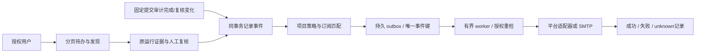

# Sidebar workflow 技术设计

- 输入：Confirmed requirements.md，REQ-001–023 / AC-001–021。
- 状态：Proposed，2026-10-07；实现进度见 implementation-plan.md。

## 工作流门禁与维护性

P10 迭代；产品契约已确认，采用现有组件与样式，无需新增设计系统。生产实现允许，先补齐 API 契约再实现页面。main.tsx 337 行、routes.go 480 行、store.go 242 行、settings.tsx 550 行。跨前端、HTTP、存储属于维护性门禁触发，风险 medium；新增职责独立模块，原文件仅注册路由/迁移/导航。无需先做大规模重构。不在设置组件继续堆积所有集成页面。

## 模块与公共接口（拟新增）

后端仍 internal/platform，按 workspace_queries、workflow_actions、integrations_store、notification_dispatch、integration_adapters、diagnostics 独立文件。前端按页面和共享筛选/分页组件拆分。旧 /runs 与详情接口兼容。

| API | 读写/权限 | 契约 |
| --- | --- | --- |
| GET /workspace/findings | 已登录/项目快照 viewer | page,size,project_id,severity,review_status；items,total,page,size；单项含 run_id、finding_id、MR、BASE/HEAD、摘要、复核状态，不含工具轨迹。 |
| GET /workspace/tasks | 已登录/项目快照 viewer | kind=pending_review/failed/incomplete；分页与总数同一授权快照；不以失败零发现推断安全。 |
| GET /workspace/usage、quality | 已登录/授权项目 | 明确时间范围、样本数、缺失与未知数据，匿名未标注不算正确。 |
| GET /runs/:id/comparison?prior_id= | 两运行均 viewer | 范围差异、新增、再观察、未再观察及证据变化；不自动判已修复。 |
| PUT /runs/:id/findings/:fid/disposition | 项目管理权限 | expected_revision、reason、owner、expires_at、status；409 冲突保留草稿。风险接受与复核结论分离。 |
| GET/PUT /projects/:id/workflow-policy | admin | revision、events、risk threshold、quality rules、owner routing、auto_followup、publish_checks；默认关闭自动动作/阻断。 |
| GET/POST/PATCH /integrations | admin | 渠道类型、项目范围、事件、频率、启用、配置、凭据写入；读取仅 has_secret，无 secret/token URL。 |
| POST /integrations/:id/test | admin，显式主动 | 保存配置下测试发送，返回投递记录 id；不隐式测试生产渠道。 |
| GET /deliveries、POST /deliveries/:id/retry | admin | 有界分页、脱敏状态、未知结果；重试记录操作者。 |
| POST /runs/:id/findings/:fid/tickets | operator+指定项目配置 | provider=jira/linear、expected revision；持久幂等关联，失败不假称成功。 |
| GET /diagnostics、POST /diagnostics/probe | admin | 本地可读检查、用户触发远端探测；不执行审计源码。 |
| POST /bots/:provider/callback | 签名与重放保护+绑定身份 | 用户绑定、一次性 nonce、权限 recheck，仅允许查看入口/复审，不允许直接合并或改复核结果。 |

实际接口变更在实现文档逐项登记，不将此拟议接口视为已实现。

## 新数据结构与生命周期

| 对象 | 新字段及默认值 | 所属/校验/兼容 |
| --- | --- | --- |
| workflow_policy | project_id、revision=1、auto_followup=false、publish_checks=false、quality_rules、routing | 项目管理；现有运行快照不可改；新运行携带策略版本。 |
| finding_disposition | run_id、finding_id、revision、status=open/accepted/resolved/unknown、reason、owner、expires_at、actor | 追加历史；接受必须理由和有效到期时间；resolved 需要固定提交与前后证据或人工明确确认。 |
| integration | id、kind、name、enabled=false、project_ids、events、frequency=instant、revision、config、secret | admin；类型 allowlist、长度限制；密钥服务端保存受文件权限保护，查询脱敏，不发回浏览器；禁用不删除历史。 |
| delivery | id、integration_id、project_id、run_id、event_key UNIQUE、payload、status=pending、attempt=0、next_attempt、lease、remote_id、error_code | 持久 outbox；摘要不含源码/工具 trace；重试最多 5 次，退避；网络结果不确定标 unknown，不承诺 exactly-once。 |
| ticket_link | run_id、finding_id、provider、integration_id、remote_id、url、status、idempotency_key UNIQUE | 权限 recheck；创建不确定保留记录，禁止直接重建造成重复。 |
| bot_binding | provider、external_user、user_id、created_at、revoked_at | 系统用户主动一次性绑定；外部名称不映射为已授权用户。 |
| callback_nonce | provider、nonce、expires_at、consumed_at | 签名校验后原子消费，失效/重放拒绝；不保存完整回调敏感内容。 |

投递：pending → leased → delivered/retry/failed/unknown；到期 lease 可恢复，但非幂等外部创建若响应丢失不能直接重发。取消渠道/撤权时 pending 标 cancelled。每日/周汇总按服务端配置时区 Asia/Shanghai 的窗口持久游标生成，窗口+渠道唯一键，处理重启和跨日。风险接受到期变 open 并生成唯一提醒事件，保留旧记录。

## 集成协议与外部边界

邮件：SMTP STARTTLS/TLS，校验 From/To，无换行注入；凭据及收件人不出日志。
飞书、钉钉、企业微信、Slack、Teams：分别实现官方文本/卡片请求结构，按平台支持校验签名/请求认证与响应业务码；不把统一 JSON 当作全部适配。Teams 使用明确配置的 webhook/workflow endpoint。Webhook 使用固定 versioned 摘要与 HMAC 签名。
GitLab 复用现有 comment ownership；GitHub 提供固定 HEAD 身份的 check/摘要适配，不能伪装为现有 GitLab runner 已支持 GitHub 全流程；需新增 provider 边界完成 GitHub 快照、diff/read/search/提交/入口授权及兼容测试。
Jira 使用 issue API；Linear 使用 GraphQL，处理成功 HTTP 中的 errors。所有 URL 对目标做 scheme/host 校验，限制重定向、超时、响应大小及 DNS/IP；默认禁止环回/link-local/元数据访问，私有部署明确 allowlist。平台详情/源码内容不进入未授权渠道。

## 覆盖、语言与修复判断

覆盖复用 Scope/AuditGroups/CoverageNotes，明确实际读过与未完成不同。格式化噪音使用有界 diff 启发式，仅标疑似、默认 advisory；Python 缩进和字符串空白未经语义判断不能宣称等价，不引入必需解析器。跨运行比较首先核对 target/source/context scope 与提交，关联使用现有指纹及人工确认。CODEOWNERS 从固定 HEAD 读取，有界解析最后匹配规则；仅推荐责任人，不能授予 ACL。

## 失败、性能与安全

分页 size 1–100，同事务查询总数与项目/源项目/上下文权限；不下载所有 result_json 或 tool traces。任何 mutation 重检角色与 revision。错误码固定脱敏，不记录外部响应正文/密钥 URL。凭据可保留/替换/明确清除。投递共享有界并发，不阻塞审计 worker。禁止外部请求在 SQLite 事务内进行。

## 迁移、回滚与验证

增量建表与索引，默认不启用集成/自动动作，保留老路由和历史数据；回滚二进制保留新表不删数据。跨项目/源项目/context ACL、撤权、分页一致性、revision 冲突、恢复/重复事件、各渠道请求协议、响应业务错误、网络未知结果、签名重放、凭据脱敏为必要测试。完整 Go/race/vet、前端 typecheck/build、嵌入资源同步、窄屏键盘 QA。真实服务验证需用户指定测试配置；缺失时明确未验证，不能假称全链路成功。
