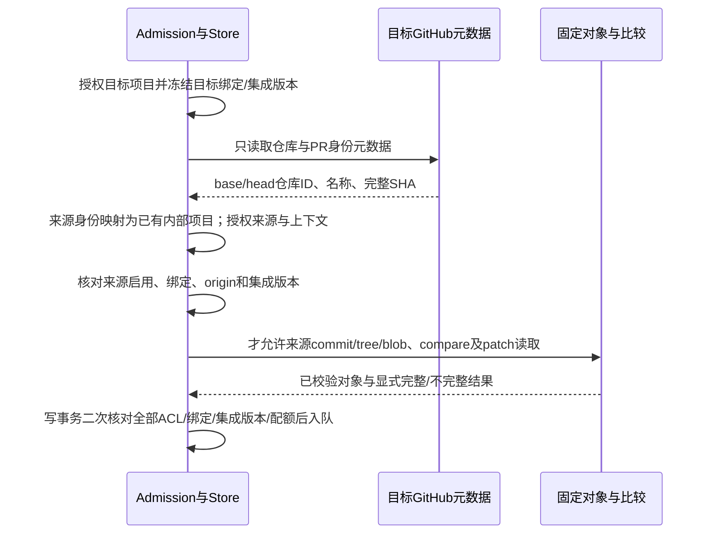

# GitHub 固定提交比较：协议证据与剩余决策

## 工作流门禁

输入：Confirmed requirements.md的REQ-012/019/021/023、github-provider-design.md及用户“没想清楚先不实现”。分支codex/sidebar-workflow，基线12f9668ea867324db976afcae304274c2a9358b4。阶段P5/P6、F2研究补充；仅更新设计证据，不作为技术方案批准，不进入PR/compare/factory生产实现。G1/G2及固定对象模块存在，但没有完整bound执行消费者；现有身份保护保留。完整REQ-001–023 / AC-001–021不缩减。

发现的上游薄弱点包括fork限定SHA语法、空commits语义及授权前访问来源内容。此次关闭其中部分协议疑问；GitHub Enterprise兼容性、完整差异及恢复设计仍未闭合。没有公开API/schema/数据库/配置变化、远端写入或新增依赖，无需运行无关构建。

## 文档事实

[官方compare说明](https://docs.github.com/en/rest/commits/commits#compare-two-commits)允许同一仓库网络内比较提交SHA，并规定跨仓库分支的owner限定写法。不分页的提交集合与分页集合具有不同末项语义；文件集合仅第一页、上限300，不能用提交分页补齐。此页面默认样例现已使用2026-03-10，不能因此改变本项目2022-11-28请求契约。

对应版本的固定[官方OpenAPI](https://github.com/github/rest-api-description/blob/734bc9c1030b774eb3fc909cce477aceea21cf77/descriptions/api.github.com/api.github.com.2022-11-28.json)证据见github-provider-design.md：没有head_commit，files非required。例子不足以证明所有状态、网络身份和授权条件；此次另外请求真实公开fork，避免把自行编写的fixture当协议证据。

## 真实只读协议探测

2026-10-07约15:53 UTC，公开[cli/cli PR #14617](https://github.com/cli/cli/pull/14617)提供样本。通过现有gh客户端执行GET，所有比较/对象/仓库请求显式设置X-GitHub-Api-Version: 2022-11-28。未修改该PR、发送评论或访问本项目生产通知/工单配置。首次匿名API读取因rate limit exceeded返回403，改用已有gh认证读取公开元数据；没有输出或保存认证值。

冻结样本（后续PR状态变化不改写此证据）：

| 对象 | 身份 |
| --- | --- |
| 目标 | cli/cli，repository ID 212613049，独立仓库GET确认fork=false |
| 来源 | bingtang9/cli，repository ID 1408291984，独立GET确认fork=true，parent/source ID均212613049 |
| B，目标分支观察提交 | 17142e08db2e300b37e6da1ddcfb651eb6d9c587 |
| H，来源提交 | 83e09829e010258ab80cfaba4daa22a167b9d8ba |
| 固定B对象 | 目标git/commits/B返回相同SHA，tree 03626743b05d209a4dcb592cb0f30e33761b3e6c |
| 固定H对象 | 来源git/commits/H返回相同SHA，tree 5817c860769933c789eb4743963be03f9a271551 |

请求前缀为GET /repos/cli/cli/compare/，全部不指定分页：

| basehead | 实际结果 |
| --- | --- |
| B...H（两处完整SHA） | ahead；base=B，merge_base=B；ahead_by=2，behind_by=0，total_commits=2，返回2个commits，末项=H，返回2个files，无head_commit |
| cli:B...bingtang9:H | 与上一行全部投影字段一致；证明本样本owner:完整SHA语法可用 |
| B...B | identical；base=merge_base=B；ahead_by=behind_by=total_commits=0，commits/files均空，末项null |
| bingtang9:H...cli:B | behind；base=H，merge_base=B；ahead_by=total_commits=0，behind_by=2，commits/files均空，末项null |

这不是自动化测试或本系统运行证明。它只验证GitHub.com、这个公开且fork名称仍为cli的网络、这些冻结提交和上述四种请求；不覆盖私有仓库/重命名fork/多fork歧义/Enterprise/diverged/超过250提交/force-push/配额耗尽/完整文件差异。反向比较是构造behind样本，不代表该PR自己的base/head顺序。

## 设计结论与消费者约束

1. owner:完整SHA在该版本/样本可用，既有“完全没有fork语法依据”的疑问可收敛；不能把用户名当repository ID证明。实际执行仍须核对目标/来源绑定ID、origin及独立仓库身份，不能从compare permalink猜来源。
2. identical和behind的合法响应没有HEAD提交末项。统一要求末项=HEAD会错误拒绝；统一允许空集合又会把缺失/异常响应洗为没有改动。候选状态判定须分别验证status、base_commit、merge_base_commit、固定B/H对象及计数，不用空集合单独证明。
3. 对behind候选，merge_base=H时merge-base→H没有源码改动；不能用B→H反向目标分支差异冒充PR新增改动。对identical候选，B=H=merge-base。上述关系判定仍须与正式对象/响应校验合同一起完成，不因单个观察自动授予实施许可。
4. 此探测尚未证明完整compare文件覆盖。完整两树差异方案必须定义模式变化、gitlink/symlink、路径集合、rename身份及补丁缺失如何传播到审计覆盖；普通源码ListFiles的2000项预算不是全仓差异保证。

拟议生产访问顺序（当前未实现）：

compare也可能泄露来源提交描述、文件路径和patch，因此它属于来源内容访问，不能在来源ACL之前请求。公开fork本身不授予本应用权限。源码、PR正文和提交说明不作为授权依据。观察前后PR相同不能证明期间读取无变化；所有实际内容必须固定SHA。

## 尚未闭合的实施前置

| 决策或证据 | 当前状态 | 进入代码前所需证明 |
| --- | --- | --- |
| fork SHA路由 | GitHub.com同名及改名公开fork均有真实证据（见下方补充） | multiple fork歧义及允许origin支持范围明确 |
| HEAD关系 | ahead/identical/behind/diverged及超过250提交样本有证据（见下方补充） | 坏/缺字段、有限计数与对象关系校验形成完整合同 |
| 差异覆盖 | compare文件上限已明确 | 固定树比较预算、rename/mode/gitlink/patch语义，截断不能无告警完成 |
| 来源权限 | 访问顺序已明确 | 未授权时零来源对象/compare访问；版本/ACL变更时入队拒绝的集成证明 |
| 入口恢复 | UAR-001仍open | 旧项目迁移/恢复及正式开放前置；不得删除身份guard或猜GitLab ID |

没有新增可被执行的核心对象；拟议Snapshot字段仍按github-provider-design.md矩阵，未新增字段。后续实现文件应分离PR观察、compare关系及固定树差异，并通过统一factory供所有入口消费，不能堆在runner.go。推出时必须与绑定开放/恢复及端到端验收一起评估；回滚保留历史身份，不将旧运行改解释为默认GitLab。当前无F3实施许可，无main合并或发布。

## 补充探测：改名fork、diverged及超过接口上限

2026-10-07约16:02 UTC（上海2026-10-08），仍只读且显式请求2022-11-28。原表记录第一轮范围；本节扩展观察范围，不回填或重解释原PR。

[cli/cli PR #14474](https://github.com/cli/cli/pull/14474)提供改名fork来源jarrensj/gh-cli，仓库GET确认ID=1376506649、fork=true，parent/source ID均212613049。来源完整H2=543ced087c7ef3a7069ebfb09f065df38240b137；用前轮固定目标B=17142e08db2e300b37e6da1ddcfb651eb6d9c587比较，不能将此B擅称该PR当时的base。

/repos/cli/cli/compare/B...H2及cli:B...jarrensj:H2均成功，投影一致：status=diverged、base=B、merge_base=0cf1092493af067646fc5f3db9421c6a6ec9c938、ahead_by=total_commits=1、behind_by=58、returned_commits=1、末项=H2、returned_files=1。这一改名来源无需在owner限定参数中填写gh-cli仓库名；说明“fork名称不同就无法比较”不成立，但不能据此省去来源ID/网络/ACL检查或证明同owner多fork所有歧义均不存在。

大比较使用仓库tags实际返回的v2.30.0提交T=570a7202c3b331a9fdc39508d3a754c6847b3513，只用完整T...B请求，后续不依赖标签仍指向该提交：

| 查询 | 实际结果 | 能证明什么 |
| --- | --- | --- |
| 不分页 | ahead；base=merge_base=T；ahead_by=total_commits=5616、behind_by=0；commits=250，末项=B；files=300，无head_commit | 提交列表被限制，但该样本末项仍为请求HEAD；文件数量不能当完整性证明 |
| per_page=1,page=1 | total_commits=5616；唯一commit=aa0f2de885b6902dbcedfc7f7c45c0f91a879099；files字段存在且300条 | 首个分页末项不是HEAD；per_page不将文件变成1条 |
| per_page=1,page=2 | total_commits=5616；唯一commit=65720e498e623795b6d44904f302f04a987a1f77；files字段不存在 | 不能从后续页缺files推导没有差异，也不能分页补齐文件集合 |

为区分“刚好300个文件”与实际遗漏，又读取T的固定git/commits对象（SHA=T，tree=c591e69f055e46a1de47cc04124e49194d69029a），以及T/B的固定tree各一份recursive=1响应。两份均校验响应SHA等于请求tree SHA、truncated=false；研究进程单份响应预算5MiB，实际205053/454673 bytes。对type!=tree的路径映射比较(mode,type,sha)，只统计，不生成patch、不做rename检测、不运行来源代码：

| 固定tree | entries / 非目录项 | 响应SHA256（不是Git对象SHA） |
| --- | --- | --- |
| T：c591e69f055e46a1de47cc04124e49194d69029a | 914 / 684 | ff3f937e3395b549c8c4e6fc52c214334d1e16c0600b772c89cd9b2232944b62 |
| B：03626743b05d209a4dcb592cb0f30e33761b3e6c | 1960 / 1493 | 7df2add9e1fcf07f501a20856d56596fe9622619b31cc9c5a4a28bee7dc08775 |

同路径内容/模式/类型变化498，新路径845，消失路径36。这些是路径级树差异数，不称为GitHub语义下的rename/文件统计；单是498个现存路径变化已超过compare返回的300项，因此该样本compare文件集合确实不足。tree探测证明独立覆盖核对的价值，不证明现有2000普通源码ListFiles能生成这种完整差异，也不证明递归接口在大仓库不会截断。生产设计仍需非递归有界树比较和完整性传播。

负例也保留：v0.1.0候选commit返回422（标签不存在），tags第50页为空；两个已知合并父节点的候选比较实际是ahead而非diverged，未作为diverged证据。随后用可观察标签/公开fork元数据选择样本，未把失败查询当生产CI失败或重新启动CI。

### 对下一步设计的影响

- 身份关系校验应覆盖四种status；不能依赖统一的非空commits假设，不分页末项与分页末项须分开处理。以上是官方协议与样本证据，坏响应/边界计数仍须明确失败策略。
- compare files只能作为固定请求下的有界补丁/rename提示；完整路径集合必须来自固定merge-base与HEAD树，不能默认300条代表完整。来源ACL必须在两种访问前完成。
- 正式差异应单独定义path/mode/objectID/type及覆盖状态；改名提示与双树事实需要一致性验证，未知rename不能伪造血缘。binary、缺patch、非法路径、预算耗尽仍须保留未知/partial；不能因“模型可以读文件”就将缺失差异视作已经覆盖。
- 本轮没有选择尚未明确的补丁生成依赖或自动绑定恢复方案，也没有生产实现。G3完整consumer合同、G4–G6及UAR-001/002/004持续未完成。
