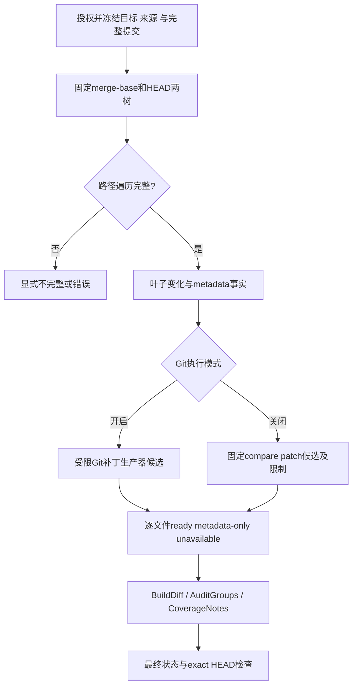

# GitHub 完整差异与补丁：设计草案

## 门禁与生命周期

输入为Confirmed requirements.md及github-provider-design.md；REQ-012/019/021/023及完整既有范围保持。分支codex/sidebar-workflow，基线6ccd147。阶段P5/P6、F2设计草案；未批准、尚无F3实施许可。当前允许设计与隔离原型验证，不允许据此开放bound执行或新写入入口。用户要求“没想清楚先不实现”。

场景：同一平台按固定提交审计GitLab/GitHub，跨项目/fork访问必须按内部项目授权；发现与合并检查不能把被截断的文件列表当完整PR。上游需求已确认，固定GitHub client/object reader已有实现，真实compare边界已验证；完整PR/factory、绑定恢复、补丁与rename消费者合同仍薄弱。无新需求确认、DB迁移、公共API变更或生产依赖变更。本文件不授予实现许可。

维护边界：github_read_client.go负责受限网络，github_read_objects.go负责对象验证，github_tree_listing.go现有ListFiles只列普通源码且有2000上限；不得当完整差异遍历器复用。新职责应拆为github_changes_tree.go、github_changes_patch.go及provider snapshot/factory，不堆进runner.go或修改通用Git错误处理来容纳特殊操作。

## 当前事实与方案选择

Settings初始化GitAudit.Enabled=true；README及Dockerfile明确既有bare Git路径，镜像安装Git。GitRepository.Changes已用固定base/head对象生成raw metadata与hunk，不checkout。GitHub内部API reader还没有生产factory消费者。

直接复用prepareGitSources不是无条件正确：当前sources共用单个token，适用于现有调用但不足以表达不同冻结集成的target/source凭据。Git子进程网络也不会自动继承githubReadClient的DNS/IP/allowedNetworks保护。API origin与GitHub clone origin不同；不能只替换URL或沿用GitLab认证假设。

| 候选 | 优点 | 必须解决的限制 |
| --- | --- | --- |
| 固定GitHub元数据＋既有Git backend | 复用完整metadata/patch与history工具 | 每来源凭据/版本、clone origin、网络限制、固定SHA拉取与失败恢复；不能盲用单token helper |
| 固定API两树＋隔离本地Git生成patch | 保留安全API读取；无需Git网络或新增自写diff算法 | 本地Git仅在git_audit开启时使用；默认历史等全部工具的provider消费者还须设计 |
| 固定API两树＋验证compare patch | git_audit关闭时遵守API模式 | 300之外/缺patch的普通文本变化必须partial；不能将其包装为完整差异 |

建议方向：两树负责覆盖真值，patch生产器遵守执行模式。Git启用可使用既有Git能力或隔离本地Git补全patch；Git关闭时禁止偷偷启动Git，保留明确API覆盖限制。此为候选方案，尚未选定默认Git backend与API＋本地patch的全部工具衔接，不将更容易通过测试的受限API模式替代完整原生执行目标。

## 拟议内部对象与消费者

无新增持久核心对象；下列为拟议操作内存值，不对外暴露、不包含token：

| 对象/字段 | 类型与规则 | 所有者/默认/兼容 |
| --- | --- | --- |
| FixedChangeSet.merge_base/head | 完整SHA；对应已授权固定对象 | factory创建，不从网页URL猜身份 |
| FixedChangeSet.entries | 按稳定路径序排序的叶子变化，保留mode/type/object ID及双侧路径 | 差异模块；含symlink/gitlink，不等于普通ListFiles |
| FixedChangeSet.paths_complete | bool；所有应展开目录完成后才true | 初始false；根树一致可直接证明无差异；不能由300文件列表设置 |
| FixedChangeSet.notes | 有限原因；覆盖缺失的已知边界 | 初始空不等于完整；未完成必须增加原因或返回错误 |
| 单文件patch状态 | ready / metadata_only / unavailable | 由已验证对象与生产器判定，缺patch不默认ready |

适配既有Repository.Changes返回[]Change、全局notes及error。单文件问题进Change.Notes，集合遍历失败进全局notes或显式error，取消保持取消。BuildDiff/Runner目前对缺hunk及CoverageNotes保留不完整；正式集成必须验证这些原因沿Audit/AuditGroups传入最终报告，不能仅确认Changes返回了notes。

## 固定树差异算法草案

1. 授权来源完成后分别解析固定merge-base/HEAD的root tree；base-tip只保留PR观察依据，不作为diff base。根SHA相同可证明无树变化。
2. 对同一路径的两目录进行非递归树读取；tree响应须身份正确、truncated=false、合法唯一entry、mode/type相符。相同mode/object ID的对应子树可剪枝，不靠普通文件数量推断覆盖。
3. 排序合并目录entry。两侧目录继续递归；只有一侧目录展开为叶子新增/删除；目录↔叶子变更展开子路径再记录叶子，不能丢掉旧目录内容。一般叶子按(mode,type,object ID)比较。
4. 分别维护路径上的祖先链，拒绝真实cycle；重复tree可在不同路径合法出现，但展开工作和累计路径字节都计预算，缓存命中不能绕过DAG展开限制。非法path、预算、响应截断不产生paths_complete=true。
5. 先建立路径集合事实，再处理rename。唯一且同mode/type/object ID的删除/新增可以作为精确内容配对候选；相同blob多候选不能任选一个。修改内容的rename需要明确提示一致性/置信度合同，未闭合前保留add/delete，不自动继承发现血缘。
6. gitlink只审计固定引用；symlink只审计链接对象，不解引用；普通ReadFile继续拒绝它们。empty tree等不能映射既有metadata的对象不得静默遗漏，必须明确coverage原因。

候选遍历预算复用现有128请求/32MiB客户端、单树响应2MiB、20,000项对象预算、64级/4096-byte路径及8MiB路径工作边界。既有预算是每client，并非共享整个run的额度：两个来源或上下文实例的累计上限、工作预算与全局deadline必须在factory计划明确，不能假称当前已有全运行共享额度。预算不满足会留下不完整/错误，不回退到动态分支或声称没有变更。

## 补丁边界与隔离原型证据

[Git官方文档](https://git-scm.com/docs/git-diff)定义no-index比较、差异时exit=1及关闭external diff/textconv的选项。本地两份受控字节可直接产生语言无关hunk，不需要自行重写diff算法。no-index不会证明对象来源身份或文件集合覆盖，这些由上述授权/固定对象/两树负责。

原型仅在/tmp临时目录写合成old/new两个固定文件名，0700临时目录、0600独占创建文件；不使用来源路径创建目录、不写symlink、不checkout、不网络访问。子进程不继承Git配置/凭据环境，配置global=/dev/null、nosystem、attr nosystem，禁用hooks/external diff/textconv，protocol.allow=never；固定--no-index --no-color --diff-algorithm=myers --unified=3。研究脚本位于/tmp/aimangebot-fixed-patch-research/probe.py，不混入生产提交。

2026-10-08（上海），Git 2.50.1 Apple Git-155的实际结果：

| 合成输入 | exit / patch bytes | 验证 |
| --- | --- | --- |
| Python / TypeScript | 1 / 139、142 | hunk存在，与语言无关 |
| UTF-8中文 | 1 / 116 | 新值字节保留 |
| CRLF | 1 / 109 | -old、+new均保留CRLF |
| 无结尾换行 | 1 / 151 | 保留No newline标记 |
| 文本新增 / 删除 | 1 / 94、96 | hunk存在 |
| 内容相同 / 两侧为空 | 0 / 0 | 正确无hunk；空文件新增需靠metadata区分，不能凭空字节推断 |
| 含NUL二进制 | 1 / 89 | 输出Binary files，不当普通源码hunk |
| 两侧各60,000行、240,000 bytes | 1 / 600097 | 本样本约31ms、输出小于8MiB；不是所有最坏输入的耗时证明 |

当前gitCommand只将grep exit=1视为正常，不能原样调用no-index并把exit=1当Git失败，也不能全局允许所有git命令的exit=1。若选此生产器须使用独立限定命令处理，保持其它命令错误语义；总deadline/单命令timeout/输出上限、临时文件清理及中断证据都要实际验证。上述原型尚未覆盖取消、超限、恶意全局配置、路径攻击、Linux镜像及真实固定blob集成。

## 开放前测试与决策

| 前置 | 验收证据 | 当前状态 |
| --- | --- | --- |
| 完整树集合 | >300修改、mode/gitlink/symlink、目录↔文件、共享DAG/cycle、截断/预算、相同根零展开 | 部分真实API覆盖证据有，生产模块未实现 |
| 补丁生产器 | newline/CRLF/Unicode/新增删除/二进制/大输入、取消/输出限制/cleanup、mode off零Git调用 | 合成11场景已验证，其余未验证 |
| rename合同 | 唯一/歧义/相同blob多路径/修改内容改名，双侧metadata与发现关联不伪造 | 草案，未闭合 |
| 默认完整工具链 | 固定读取/搜索/目录/历史/CODEOWNERS/跨项目/组审消费者 | GitHub factory与统一执行未实现 |
| 凭据与网络 | target/source分版本授权，撤权零新访问，Git网络不绕过受限策略 | 直接helper复用不可接受，待完整方案 |
| 状态传播 | 每个覆盖缺口实际使报告/远端检查保持不完整，exact HEAD及权限复查 | 集成证明缺失 |
| 绑定上线/恢复 | UAR-001用户流程恢复和正式开放前置 | 未明确；不能删guard或猜GitLab ID |

不修改confirmed需求。后续先关闭默认工具链、rename和共享预算/网络模式决策，再形成F3分文件实现计划；不得仅将本原型包装成Github支持完成。回滚与兼容保持旧nil GitLab项目路径、冻结历史身份、原Git命令错误语义；不删除绑定或自动迁移凭据。当前没有main合并/发布或完整分支批准。
