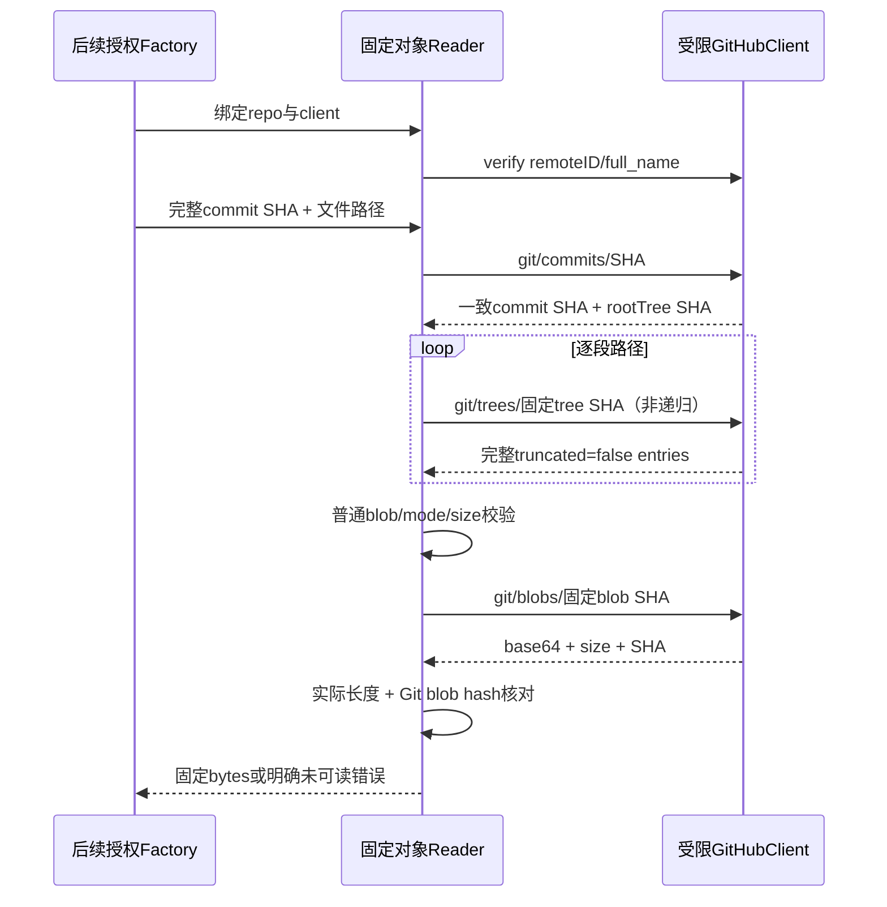

# GitHub 固定 Git 对象读取

## F2 / Workflow Gate

输入：Confirmed完整REQ、github-provider-design.md G3与已实现github-read-client-plan.md。分支codex/sidebar-workflow，P6→P8；现有绑定与读取transport已具备。当前仅有受限客户端，尚无固定commit/tree/blob语义。implementation allowed=yes，F2/F3先提交推送；本阶段不改变HTTP入口/Runner/admission的bound unavailable，不缩减G3–G6、邮件/bots/自动闭环等原范围。

Maintainability Gate：新增独立github_read_objects.go（对象/路径读取）与github_tree_listing.go（稳定有界枚举），复用GitEntry与githubReadClient；避免在repository.go/Runner/settings堆新provider分支。无schema/公开API变更，无新依赖。读取器归属某个已冻结repo客户端；构造先verifyRepository，其调用者仍须事先执行完整ACL/启用/绑定版本检查，读取器不授予权限。

| 对象 | 字段/校验 | 所有者/生命周期 |
| --- | --- | --- |
| githubObjectReader | 私有client、commit→rootTree cache、SHA→不可变tree cache、累计entry数、commit→完整path列表cache、序列化gate | factory阶段创建；不序列化凭据；结束释放内存，不保存跨用户共享cache |
| githubTreeEntry | basename UTF8/非control/非dot/≤255bytes；GitEntry(mode/type/objectID)；size/known | 100644/100755/120000必须blob且已知非负size；040000必须tree；160000必须commit；未知mode/type整目录拒绝 |
| commit/tree/blob DTO | SHA为非零小写40hex；commit.sha与请求相同、tree root有效；tree.sha相同且truncated显式false、tree非null；blob.sha相同、base64、size/content明确 | 只接受固定SHA，branch/tag/缩写/64hex未知算法不进入GitHub REST对象路由；无需更改既有支持64SHA的本地Git逻辑 |

固定源码：ReadFile先GET git/commits/完整SHA取root SHA（校验top.sha），再逐段GET非递归trees/树SHA；完全省略recursive参数，忽略上游url/download_url。父目录完整响应后方可确认path_absent；截断/字段缺失/重复basename/未知mode/cycle不能作为不存在。每目录≤2000 entries、缓存累计≤20000、完整路径≤4096bytes/64段，超界明确失败；Unicode/空格名字可读取，control、绝对路径、NUL、../、双斜杠拒绝，不进入网络对象操作。

普通源码只能100644/100755；symlink120000与submodule160000保留元数据但拒绝ReadFile，不沿链接/外部repo。blob已知size>256KiB在GET blob前拒绝；正文≤512KiB、解码后≤256KiB，decoded size等于API与tree size，并重算SHA1("blob <len>\\0"+bytes)核对tree对象ID。低层返回bytes保持二进制原值；后续Repository adapter需单独声明普通文本/二进制覆盖，不用UTF8替换破坏源码证据。commit/tree只核对API返回SHA和结构，不声称独立重算对象内容hash或签名。

目录/列举：目录读取返回副本，不允许调用者修改cache；完整递归枚举按非递归子树串行遍历，允许不同目录共享同一tree SHA（路径不同），只拒绝沿祖先重复SHA的cycle；没有任何Git对象路由查询branch。整个完整枚举≤2000普通文件、100文件每页/20页，路径稳定排序；只有全部遍历成功才写入列表cache。失败返回error且无成功partial列表，不能用尚未列举路径证明不存在。symlink/gitlink不作为普通文件列出。reader序列化gate可由context取消，成功commit/tree cache不重复读取；client128请求/32MiB预算贯穿对象/目录/list，无重试重置或失败cache。

失败固定分类，不泄露token/URL/body；临时/限流/context错误原样保留已有脱敏分类。404表示source unavailable而不是path_absent，tree truncated表示tree incomplete，未知/格式/对象ID漂移拒绝。预算失败仍是未可读，不自动回落到GitLab/contents/动态分支。回滚只移除内部对象读取器；bound执行保护及原nil GitLab保持，远端无写入。

来源（2026-10-07核对）：[Git commit object](https://docs.github.com/en/rest/git/commits#get-a-commit-object)、[Git tree](https://docs.github.com/en/rest/git/trees#get-a-tree)、[Git blob](https://docs.github.com/en/rest/git/blobs#get-a-blob)。读取API版本继续2022-11-28，github-read-client-plan已有版本支持证据。tree mode与truncated按官方契约；实际256KiB/2000文件等为本系统预算，不是GitHub服务端上限。

## F3 实施计划

新增github_read_objects.go：verified reader构造、context可取消串行gate、严格SHA/UTF8路径校验、commit/tree缓存与完整性校验、目录逐段解析、普通文件读取与blob hash/size验证；新增github_tree_listing.go：固定root非递归完整枚举、祖先cycle、普通文件稳定100分页。遍历还限制≤20000展开entry、队列path累计≤8MiB，防止共享tree DAG在缓存命中时指数展开；完整列表按root SHA缓存，累计path cache≤8MiB，超界返回error而非成功部分页。列举不得缓存失败/partial结果；返回值复制。

新增github_read_objects_test.go/github_tree_listing_test.go，用真实TLS fixture与read-client预算：固定SHA/旧对象读取/缓存与Unicode空格；输入零object HTTP；commit/tree drift/缺字段/truncated/重复path/未知mode/nullsize/entry/depth/cache预算拒绝；symlink/submodule/目录不可源码且零blob访问；blob坏base64/缺字段/错SHA/假size/内容hash不符/零字节与256KiB/二进制原字节；404/限流/取消不冒充absence；稳定分页/reused subtrees/cycle/2000+文件/展开预算/失败重试不缓存partial，以及并发gate取消。现有GitHub read客户端、CodeOwners/metadata专项race和全Go/vet/build/diff完成后提交；前版e6a2f35精确CI37640077799终态后再推生产。无frontend改动/真实凭据/远端通知/模型调用。

文档保存实际实现、已验证和未验证的边界；后续PR observation/compare/diff/metadata、RepositoryFactory及完整snapshot ACL执行仍保留，不把对象reader视作完整G3或可运行Github审计。

## F4/F5 当前实现与证据

F2 1327caf与F3 130e163均已先推。新增github_read_objects.go（281行）与github_tree_listing.go（103行），verified repo reader/串行可取消gate、固定commit/tree caches、严格非递归目录/路径/模式/size/完整性、普通blob读取及实际Git SHA1 hash、稳定有界普通文件枚举与不可变副本。binary低层bytes保持，不把它声称普通文本；上层Repository adapter仍待实现。完整列表按root缓存，失败不缓存partial路径，HTTP/tree entry/展开工作/path bytes均有独立上限。

真实本地TLS fixture（fixture token、无外部请求）的对象首轮race34512平台2.094s；加入listing后Github Objects/Listing/ReadClient race80538平台2.155s通过。补充不同历史commit读取后，最终Github Objects/Listing/ReadClient及CodeOwner扩大race80694平台2.592s通过，最终vet/build27979及diff成功。覆盖Unicode/空格/executable普通文件、固定SHA路由（拒绝branch/缩写/64hex/零SHA/uppercase）、commit/tree identity漂移/缺失完整性字段、truncated/null/重复basename/未知mode/size缺失或负值、2001单目录/全cache entry阈值拒绝、symlink/gitlink/directory拒绝源码且零blob访问、已知超256KiB零blob访问、bad base64/encoding/字段/SHA/size/hash拒绝、空blob与恰256KiB及二进制原字节、完整目录才能path_absent、404/429不变absence、waiting gate context取消、旧/新/旧commit读回各自bytes。

Listing覆盖稳定100×分页/超末页空列表/invalid page拒绝、不同目录复用tree不重复HTTP、调用者修改返回值无cache污染、并发cached页保持、真实root祖先cycle失败且无成功部分列表、截断后显式重试重新读取缺失tree、2001普通文件跨目录拒绝、path cache阈值、共享二叉tree DAG展开预算（少量缓存HTTP不造成无限工作）。未证明真实PR force-push/来源fork授权（尚无PR observation/factory）、完整所有深度/字节预算boundary组合、跨actor授权与Run工具接入；这些仍保留下一阶段，不能以单repo对象fixture替代。

当前最终全Go41126仍运行，待终态后写结果；无frontend改动/真实凭据/模型/外部发送。前版e6a2f35精确CI37640077799已completed/success。G3的PR snapshot/compare/diff/metadata与factory、G4–G6及其余完整REQ持续未完成；bound admission保护保持，未合并main或发布。

最终生产代码全Go41126已completed/success（platform117.857s，其余包通过）。其后只补测试独立Git空blob golden SHA，避免fixture与生产hash同时存在相同错误；生产代码保持，golden专项另行验证。F4/F5对象读取切片可在该专项通过后提交推送，并跟踪独立精确CI。

独立空blob golden专项race34150 completed/success平台4.312s；最终diff检查通过。所有生产源码已由全Go41126、扩大race80694、vet/build27979验证，后补golden无生产改动且已专项通过。准备推送对象读取切片，尚需新HEAD精确CI。

交付：d7ad25c016c83add228d1f58aab0cb7697d3de67已推codex/sidebar-workflow，ls-remote确认remote HEAD相同，工作树干净。精确CI37642268857已in_progress：https://github.com/Ed1s0nZ/AIMergeBot/actions/runs/37642268857 。初次列表暂时为空，未据此重启/取消或声称通过；随后同完整SHA已查到对应run。前版e6a2f35 CI37640077799 success，新版继续独立验收。完整GitHub审计/其余REQ不因此完成，无main合并/发布。

验收更新：2026-10-07T15:17:04Z，精确CI37642268857 completed/success；gh run view核对headSha=d7ad25c016c83add228d1f58aab0cb7697d3de67。verify内Go tests and race checks、Operations tooling tests、Reachable Go dependency vulnerabilities、Frontend build、Embedded application build均success，无跳过这些步骤或替代HEAD证据。对象读取切片已完成本地与该HEAD CI验证；尚未完成PR observation/compare/factory，不能据此认定GitHub审计可用。用户新增“只要没想清楚的，都先不实现”约束见implementation-plan.md，剩余设计先澄清，不新增未经明确契约的生产功能。此前GitHub推送500已恢复，9b80ede/beb45e2/8ce7a90文档提交均已随8ce7a90成功推送。
