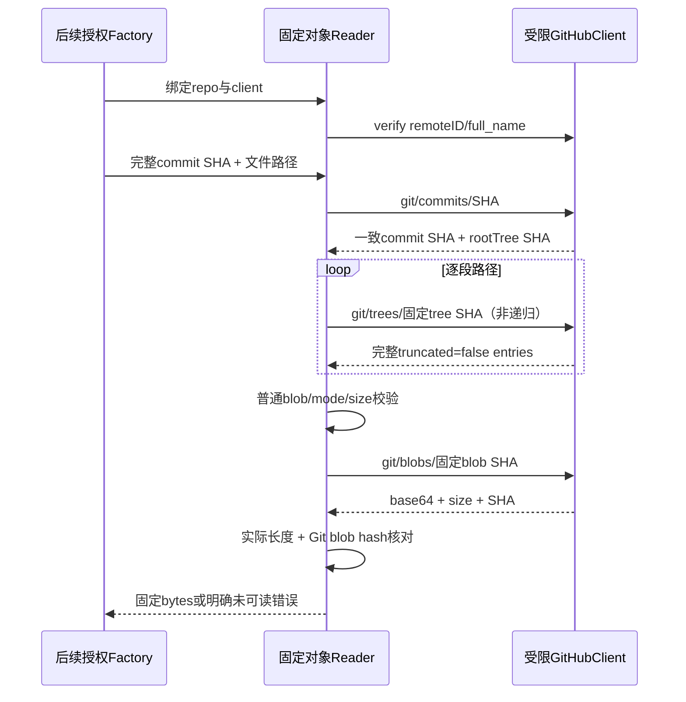

# GitHub 固定 Git 对象读取

## F2 / Workflow Gate

输入：Confirmed完整REQ、github-provider-design.md G3与已实现github-read-client-plan.md。分支codex/sidebar-workflow，P6→P8；现有绑定与读取transport已具备。当前仅有受限客户端，尚无固定commit/tree/blob语义。implementation allowed=yes，F2/F3先提交推送；本阶段不改变HTTP入口/Runner/admission的bound unavailable，不缩减G3–G6、邮件/bots/自动闭环等原范围。

Maintainability Gate：新增独立github_read_objects.go（对象/路径读取）与github_tree_listing.go（稳定有界枚举），复用GitEntry与githubReadClient；避免在repository.go/Runner/settings堆新provider分支。无schema/公开API变更，无新依赖。读取器归属某个已冻结repo客户端；构造先verifyRepository，其调用者仍须事先执行完整ACL/启用/绑定版本检查，读取器不授予权限。

| 对象 | 字段/校验 | 所有者/生命周期 |
| --- | --- | --- |
| githubObjectReader | 私有client、commit→rootTree cache、SHA→不可变tree cache、累计entry数、commit→完整path列表cache、序列化gate | factory阶段创建；不序列化凭据；结束释放内存，不保存跨用户共享cache |
| githubTreeEntry | basename UTF8/非control/非dot/≤255bytes；GitEntry(mode/type/objectID)；size/known | 100644/100755/120000必须blob且已知非负size；040000必须tree；160000必须commit；未知mode/type整目录拒绝 |
| commit/tree/blob DTO | SHA为非零小写40hex；commit.sha与请求相同、tree root有效；tree.sha相同且truncated显式false、tree非null；blob.sha相同、base64、size/content明确 | 只接受固定SHA，branch/tag/缩写/64hex未知算法不进入GitHub REST对象路由；无需更改既有支持64SHA的本地Git逻辑 |

固定源码：ReadFile先GET git/commits/完整SHA取root SHA（校验top.sha），再逐段GET非递归trees/树SHA；完全省略recursive参数，忽略上游url/download_url。父目录完整响应后方可确认path_absent；截断/字段缺失/重复basename/未知mode/cycle不能作为不存在。每目录≤2000 entries、缓存累计≤20000、完整路径≤4096bytes/64段，超界明确失败；Unicode/空格名字可读取，control、绝对路径、NUL、../、双斜杠拒绝，不进入网络对象操作。

普通源码只能100644/100755；symlink120000与submodule160000保留元数据但拒绝ReadFile，不沿链接/外部repo。blob已知size>256KiB在GET blob前拒绝；正文≤512KiB、解码后≤256KiB，decoded size等于API与tree size，并重算SHA1("blob <len>\\0"+bytes)核对tree对象ID。低层返回bytes保持二进制原值；后续Repository adapter需单独声明普通文本/二进制覆盖，不用UTF8替换破坏源码证据。commit/tree只核对API返回SHA和结构，不声称独立重算对象内容hash或签名。

目录/列举：目录读取返回副本，不允许调用者修改cache；完整递归枚举按非递归子树串行遍历，允许不同目录共享同一tree SHA（路径不同），只拒绝沿祖先重复SHA的cycle；没有任何Git对象路由查询branch。整个完整枚举≤2000普通文件、100文件每页/20页，路径稳定排序；只有全部遍历成功才写入列表cache。失败返回error且无成功partial列表，不能用尚未列举路径证明不存在。symlink/gitlink不作为普通文件列出。reader序列化gate可由context取消，成功commit/tree cache不重复读取；client128请求/32MiB预算贯穿对象/目录/list，无重试重置或失败cache。

失败固定分类，不泄露token/URL/body；临时/限流/context错误原样保留已有脱敏分类。404表示source unavailable而不是path_absent，tree truncated表示tree incomplete，未知/格式/对象ID漂移拒绝。预算失败仍是未可读，不自动回落到GitLab/contents/动态分支。回滚只移除内部对象读取器；bound执行保护及原nil GitLab保持，远端无写入。

来源（2026-10-07核对）：[Git commit object](https://docs.github.com/en/rest/git/commits#get-a-commit-object)、[Git tree](https://docs.github.com/en/rest/git/trees#get-a-tree)、[Git blob](https://docs.github.com/en/rest/git/blobs#get-a-blob)。读取API版本继续2022-11-28，github-read-client-plan已有版本支持证据。tree mode与truncated按官方契约；实际256KiB/2000文件等为本系统预算，不是GitHub服务端上限。
