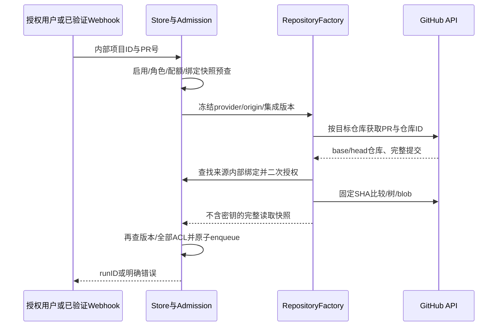

# GitHub 原生 PR 审计：身份、固定提交与执行边界

状态：技术设计，未实现。输入为 Confirmed requirements.md 默认 GitLab+GitHub范围及REQ-012/019/021/023；不缩减邮件、机器人、自动闭环等其余需求。分支codex/sidebar-workflow。P5–P6/F2–F3；当前身份设计补齐后先实施存储边界，后续接口/页面按各自gate补齐，不把设计当验收。

## 当前事实与目标

Project仅id/name/enabled，platform_projects.id直接承载GitLab远端ID；Snapshot含ProjectID/SourceProjectID/MRIID/DiffVersionID，没有provider。Runner.Submit及执行、DynamicRepository/DynamicAuditor、Poll和context_repository_runner硬编码NewGitLabRepository。AuditPolicy.RepositoryURL取全局GitLab URL。集成配置允许github只是凭据容器。GitHub CODEOWNERS共享匹配器已经存在，但没有真实GitHub仓库客户端。

目标：同一服务同时管理两平台项目，内部ACL/配额/运行关联采用内部project ID；每次运行冻结provider、API origin、目标/来源仓库身份、完整HEAD、base/merge-base与读取凭据版本。不能从任务URL猜provider，也不能用GitHub数字ID顶替同值GitLab项目。公开MR字段为兼容载体，GitHub页面按PR显示，后续可加change_request_number别名而不删除mr_iid。

## 拟议对象与迁移

| 对象 | 字段 | 类型/默认/校验 | 所有者与兼容 |
| --- | --- | --- | --- |
| platform_project_repositories 新表 | project_id PK/FK、provider、api_origin、remote_id、full_name、integration_id、revision | provider github/gitlab；ID正整数；GitHubowner/repo严格双段；origin规范HTTPS API根，不含凭据/query/fragment | admin明确绑定，项目ID不变；绑定不能授予ACL |
| repository_binding_history 新表 | project_id、revision、配置JSON、actor、created_at | 追加历史，不存token | 同事务配置/历史/事件；CAS冲突409 |
| AuditPolicy 可选 RepositoryBinding | provider/origin/target/source/版本/integrationID与revision | 不含凭据；纳入policyDigest | 旧nil保持当前GitLab执行路径；新运行不可按当前绑定重解释 |
| RepositoryIdentity | internal_project_id、remote_id、full_name | provider+origin+remote_id为远端权威身份，name只提供请求路由并需验证ID | Source必须是已有启用项目绑定；未知fork拒绝，不能自动授权 |
| 运行固定差异信息 | base_tip_sha、merge_base_sha、head_sha | 完整有效SHA；三者用途明确 | GitHub审计使用merge-base→HEAD，base_tip保留目标分支观察依据；不滥用DiffVersionID |

绑定唯一性为(provider,api_origin,remote_id)，GitLab原ID与新内部ID不得混为一个命名空间。第一阶段只为既有项目添加显式绑定API，不分配/导入新项目；第二阶段创建GitHub项目在SQLite写事务分配内部ID，现有GitLab按远端ID导入路径遇到已经绑定其他provider的内部ID必须报冲突，不能ON CONFLICT覆盖。项目配置同步保留新增绑定元数据，启动导入不得把GitHub项目降级为GitLab。

旧项目没有绑定时继续全局GitLab设置；旧运行不补猜provider，也不回填当前映射。旧nil与显式新GitLab绑定由各自测试覆盖。绑定改动不重写历史任务或凭据；禁用/删除集成使运行不能继续远端访问。API origin或绑定版本改变，旧运行明确failed/cancelled；重审由授权用户创建新运行。初始Github使用已保存token；GitHub App安装凭据自动刷新另有生命周期，不把普通token声称支持所有check权限。

## 操作流与模块边界

新增repository_binding.go/migration负责存储与身份校验；http_repository_binding.go使用真实session/origin/admin/CAS；repository_factory.go冻结客户端供Submit/execution/retry/followup/CODEOWNERS/context统一调用。GitHub HTTP、snapshot、changes、tree/blob、metadata分模块，不能在settings.go或runner.go堆大量平台分支。现有Repository接口保留；必要元数据通过可选接口与policy字段提供。各provider工具Search/Read/List/PR语义一致使用固定提交，不以GitHub动态code search替代仓库快照搜索。

## 固定提交读取与覆盖

GitHub PR files接口是动态PR视图，最多3000文件，不可直接当不可变diff版本。首选固定merge-base与head SHA的compare请求，验证返回HEAD/merge-base；compare文件列表有独立截断限制，达到限制/未知数量或缺patch明确记录CoverageNotes，不能承诺全部diff。后续复用已有Git对象读取模式取得完整差异；不能用反复读PR前后相同来证明中间所有内容不可变。PR来源仓库ID/name/origin必须与被冻结身份一致，force-push仍按旧SHA读，找不到旧对象返回来源不可用。

ReadFile不使用任意download_url，不跟随上游URLs；先固定commit解析tree，按路径段遍历非递归tree并验证mode，读取blob SHA/base64/实际大小。禁止symlink(120000)与submodule(160000)作为普通源码；CODEOWNERS只接受100644/100755。tree truncated不能作为不存在证明。全局字节/项数/深度/请求/时间预算贯穿遍历，超限明显partial或error。ListFiles分页由已捕获树序列产生稳定有界页，不能逐页重读分支。路径UTF8、NUL、../、双斜杠与控制字符按现有工具边界校验。

参考：GitHub contents会解引用正常symlink且目录上限1000，因此目录存在性证据改用tree接口。tree recursive响应存在truncated，必须检测。任何base/source对象读取都先检查对应内部项目ACL，不通过公开fork获得权限旁路。

## 入口、发布与失败生命周期

手工Submit、poll、Webhook、Slack复审、automatic followup均经同一factory/admission；Webhook验证原始body HMAC SHA256、事件allowlist、delivery ID持久去重、绑定目标仓库ID，不执行来自payload的URL。PR synchronize产生新固定提交运行；旧任务不覆盖新PR显示状态；closed/merged进入持久去重与关联处理，不能仅凭未再次观察把发现改为resolved。

发布保留持久outbox/lease/配置版本/权限复查，默认publish_checks=false。GitHub check/commit-status权限分别诊断；check写入使用固定HEAD、远端回执与当前候选仲裁，summary归属可识别且有限正文。旧HEAD的回执不能替换新HEAD；网络结果不确定保留unknown，不自动重复创建。发布前及之后核对原请求者、target/source/context权限和当前PR身份；并发新提交时不能宣称状态阻断覆盖新HEAD。自动动作禁止直接merge。

网络复用安全transport：无proxy/redirect，限制DNS/IP与管理员allowlist、TLS、响应字节和超时；error只输出固定脱敏分类。token不进policy、模型工具结果、日志或进程参数；远端调用在DB事务外；事务后二次复查。限流/read-only重试有界，外部非幂等创建仍沿用unknown处理。诊断区分本地绑定、token可用性与实际远端能力；用户主动探测才发请求。

## 实施顺序与证明

| 阶段 | 交付 | 关键证明 | 回滚 |
| --- | --- | --- | --- |
| G1 | 绑定schema/Store/历史，内部与远端身份验证 | 两平台同remoteID、跨origin、CAS并发、ABORT整体回滚、旧库重开/旧nil兼容、无ACL新增 | 保留新增表；旧行为仅nil项目 |
| G2 | 登录HTTP与项目管理绑定/内部ID创建/同步 | anonymous/member/origin拒绝；不泄密；启动同步不覆盖provider；403/409/slow/narrow UI | 禁用新入口，保留历史 |
| G3 | factory+GitHub固定snapshot/tree/blob/diff/metadata | 受控真实HTTP fork/forcepush/truncated/missing/symlink/Unicode/预算/错误origin零访问 | 不启用未完成binding执行 |
| G4 | Submit/run/retry/context/CODEOWNERS全链接入 | 完整snapshot ACL二次复查、全部工具固定SHA、模型fixture审计完整/partial真值 | provider gate显式unavailable |
| G5 | poll/webhook/新提交/自动followup与合并去重 | 签名重放、消息乱序、权限/配额/政策变化；不自动resolved | 默认自动动作关闭 |
| G6 | checks/summary/diagnostics及整体验收 | exactHEAD/readback/lease/unknown/新提交竞态；controlled protocol；全Go/race/vet/frontend/精确CI | publish默认off |

初始G1不新增外部请求或自动操作；具体HTTP字段在G2前另写API/UX gate。运行factory不得在G3后保留任何Github→GitLab fallback。审计策略/自动owner通知/邮件及其他机器人仍按原需求继续，G1完成不等于GitHub可使用。最终需正式用户场景证明而非构造Repository通过单元测试。

来源（2026-10-07）：[PR API](https://docs.github.com/en/rest/pulls/pulls)、[compare commits](https://docs.github.com/en/rest/commits/commits#compare-two-commits)、[Git trees](https://docs.github.com/en/rest/git/trees)、[contents](https://docs.github.com/en/rest/repos/contents)、[check runs](https://docs.github.com/en/rest/checks/runs)、[Webhook签名](https://docs.github.com/en/webhooks/using-webhooks/validating-webhook-deliveries)。实现时再验证具体API版本、权限和compare限制，不以此概览替代契约测试。

### G2 开放入口的必要顺序

G1内部Store存在不代表Runner理解显式绑定。G2不得直接开放Github保存/新项目Submit：必须先让admission、poll和重审识别显式绑定并在factory未实现时返回明确repository_unavailable，全部远端读取为零；提交前后还需检查绑定版本，防止网络读取期间从legacy改为新provider。该保护与G3统一factory完成后再启用实际执行。原nil项目保持legacy行为，不能因为“有配置”静默向GitLab查询同值ID。此条件是实现约束，不新增用户确认要求。

### 当前实施状态（2026-10-07）

上文“当前事实”是设计创建时的基线：现已实现G1绑定存储与历史、G2 HTTP/配置同步/原生创建/管理页面，G3安全读取client及固定commit/tree/blob/目录列表的内部模块。bound执行仍由guard明确拒绝，repository_execution_available=false；PR observation/compare/diff/metadata、统一factory与G4–G6尚未完成。具体证据见github-read-client-plan.md、github-fixed-objects-plan.md及repository-management-ui-gate.md，不把这些配置与读取模块等同原生GitHub审计可用。

### G3 研究纠正与待解决契约（2026-10-07）

按用户“只要没想清楚的，都先不实现”的约束，本节记录研究结果，不授予实施许可。上文“验证返回HEAD/merge-base”仅为目标，不能假设compare响应存在head_commit字段。核对[GitHub官方OpenAPI描述](https://github.com/github/rest-api-description/blob/main/descriptions/api.github.com/api.github.com.json)的compare 200 schema（info.version=1.1.4）后，属性包含base_commit、merge_base_commit、commits、total_commits，但无独立head_commit；files也不在required中。此次读取的是main当前描述，不是已固定2022-11-28的版本证明，不将此schema直接当现有客户端版本契约。

[官方compare文档](https://docs.github.com/en/rest/commits/commits#compare-two-commits)说明：不指定分页时最多返回250个commits且末项为整个比较的最新commit；分页时末项不一定是整个比较末项，文件仅第一页提供且最多300个。提交分页不能补全文件列表；不能把空commits或缺files解释为没有差异，也不能把分页末项一律当HEAD验证。现有固定对象读取器尚未解决这些compare语义。

进入实施之前需明确并记录以下证据：固定SHA与fork限定语法在所选API版本的支持；HEAD/merge-base的身份与关系验证，包括相同提交、behind/diverged、超250提交及缺字段；独立固定树比较如何证明文件覆盖并保留mode/gitlink/rename与patch缺失真值；来源绑定/ACL完成前零来源内容访问，以及入队前权限和绑定版本复查。仅有概览或fixture按自行假定字段返回不构成协议证明。未闭合前不添加PR/compare生产实现、不开放bound执行；完整G3–G6目标保留。

版本证据补齐：后续找到官方独立2022-11-28描述，并用[固定上游提交734bc9c的版本文件](https://github.com/github/rest-api-description/blob/734bc9c1030b774eb3fc909cce477aceea21cf77/descriptions/api.github.com/api.github.com.2022-11-28.json)重新读取核对，文件SHA256=b92c29b7f50cb047089aaa27ca6086ea1d0c9edd25cc22079e7ccdaf743bb582，与首次版本文件读取一致。该版本compare操作说明明确允许同仓库或同network的跨仓库commit SHA；其200响应同样无head_commit且files非required。由此关闭“2022-11-28是否支持commit SHA比较”的文档疑问，但不关闭fork限定路由、同一网络关系、来源权限与远端实例兼容性验证。

候选身份校验方法仍须设计完整：无分页比较可按契约核对非空commits末项SHA，但behind/identical时不能要求必有HEAD项；空集合需通过固定对象与关系另行验证，分页末项不适合作统一身份依据。merge_base_commit/base_commit各有commit对象，并不自动证明本系统解析的目标/来源ACL身份正确。完整文件差异候选为固定两树的mode/objectID/path比较；尚需确认比较预算、rename语义与生成patch的取舍，不以300文件API列表或2000文件普通源码枚举证明全仓覆盖。此为研究结果与候选方案，未进入F2/F3实施许可。

协议证据补充：见[github-compare-protocol-evidence.md](github-compare-protocol-evidence.md)。2022-11-28真实公开fork请求证明该样本owner:完整SHA可用，并证明identical/behind可以合法返回空commits；源码读取顺序将compare也纳入来源ACL之后。仅缩小协议不确定性，不关闭diverged/大比较/rename与完整差异、来源权限集成或UAR-001恢复，不授予生产实施许可。

研究进展（上海2026-10-08）：上述证据文档补充真实改名fork/diverged、5616提交/250返回、首二页文件字段差异，以及两份truncated=false固定树核对。compare返回300项而同路径变化498，证实独立完整差异集合的必要性；不选未经明确的patch/rename实现，不将协议样本当应用端授权/执行验收。

完整差异设计草案见[github-diff-design.md](github-diff-design.md)：核对默认Git审计与镜像依赖，识别单token/network helper复用限制，定义两树覆盖/模式/rename/partial边界，并验证隔离no-index合成字节原型11场景。草案未批准，默认完整工具链、rename、共享预算/网络及绑定恢复仍待闭合，无F3实施许可。
