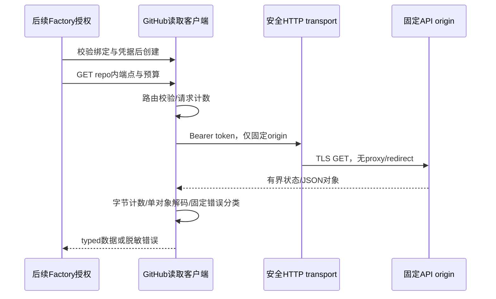

# GitHub 固定提交读取客户端

## F2 / Workflow Gate

输入：Confirmed requirements.md完整需求与github-provider-design.md G3。分支codex/sidebar-workflow；P6→P8。仓库绑定/原生创建/页面已实现，G3真实provider尚未实现。此设计补齐读取客户端的具体网络契约；implementation allowed=yes，F2/F3先推再生产代码。既有factory/admission保护继续拒绝bound执行，直到G4完整snapshot授权接入；无UI/API新入口，不缩减G3–G6及其他REQ。

当前GitLab客户端使用普通upstreamHTTPClient，不能直接用于新GitHub token请求。复用notificationHTTPClient的无代理、无重定向、固定解析IP拨号、TLS≥1.2、15s请求超时与显式私网CIDR规则；不改既有通知/GitLab行为。新github_read_client.go为internal/platform独立模块，不在Runner/settings加入平台分支。Maintainability Gate：新单一职责读取模块，无高复杂文件扩张；网络授权与响应解码分小方法，可复用现有credential校验与RetryInfo。

对象：githubReadClient（非公开、每次factory解析创建），私有binding/API origin/token/http client、mutex、累计request/bytes；凭据不进入Snapshot/policy/模型/错误。构造必须合法github binding revision>0、启用凭据完整、canonical endpoint与binding origin相同、token≤4096无空白/control。不验证真实token权限；实际GET身份检查须remoteID/full_name一致（名称大小写不敏感）。当前客户端不查ACL：factory/admission必须在网络之前及入队时查目标/来源/context完整权限，不能把此client当授权入口。

请求仅GET：suffix只能为repo内绝对路径且不能含query/fragment/escape、双斜杠、dot traversal/control；根路由由验证后的owner/repo生成。query由调用代码显式提供，拒绝raw URLs/Link/download_url，不能访问其他repo或origin。响应只接受200 JSON对象，允许GitHub追加未知字段，禁止null/array/多段JSON/尾随文本/非法UTF8；正文独立上限≤8MiB，客户端累计≤32MiB及128次请求，超限无未声明partial成功。计数并发安全，每次错误消耗已用预算；最多limit+1 bytes判断超限。每次请求15s和调用者context为时间边界，后续tree traversal共用client预算；读取方法不内建自动重试，不把发布写入放入此client。

错误只公开固定分类+HTTP status；不包裹URL/token/provider body或上游错误。context取消/超时返回标准context错误。429/5xx，以及403有Retry-After或remaining=0，使用现有脱敏upstreamError/RetryInfo source=github并保留有界Retry-After，交给原调度器，不睡眠或请求重试；普通401/403/404/410/422明确失败，不把not found解释为文件不存在（树完整读取后才能确定）。重定向禁止且零后续HTTP，不对另一个host发送token。

API版本明确固定2022-11-28（当前官方仍支持、与旧GHES兼容），不依赖不带header默认版本；后续G4policy记录冻结版本，版本升级另加契约测试。官方2026-03-10存在新增版本，但不未经验证切换；410明确version unavailable。官方版本表支持2022-11-28至2028-03-10，实施依据2026-10-07网页。

参考：[API版本](https://docs.github.com/en/rest/about-the-rest-api/api-versions)、[trees](https://docs.github.com/en/rest/git/trees)、[blobs](https://docs.github.com/en/rest/git/blobs)、[compare](https://docs.github.com/en/rest/commits/commits#compare-two-commits)。trees即使recursive=false也会启用递归，非递归必须完全省略query；compare仅首page最多300文件，不能分页声称完整。后续读取模块必须把这些边界落实为覆盖真值；本client本身不代表完整固定取证。

回滚/兼容：仅增加内部读取模块，未接Runner/HTTP也不改变execution_available；没有新schema/外部自动操作。原nil GitLab运行兼容保持。临时TLS fixture可注入test transport，只在测试构造，生产构造始终使用安全transport。

## F3 实施与验证计划

新增github_read_client.go：构造/clone绑定与allowlist，固定header/version、repo suffix校验、安全GET、有界JSON decode、并发request/byte预算、固定错误与RetryInfo分类、远端repoID/name验证。累计字节并发时先预留每请求limit+1，结束退还未读取字节；无法完整预留时不发HTTP，不能并发超过全局上限。新增github_read_client_test.go真实httptest TLS与内部test client替换（不开放生产注入）：正确header/Enterprise API前缀；多种invalid配置和路径零HTTP；redirect第二目标零命中；401/403/404/410/422/body含secret无泄漏、429/5xx/403限流RetryInfo；长Content-Length/未知长度/累计/并发request预算/无效JSON/数组null尾随/Unicode；context取消；repoID/name漂移；生产transport禁止loopback/proxy及复制allowlist。

运行定向race、相关安全transport/retry专项race、全Go、vet/build/diff；记录真正覆盖及未覆盖项。前版c73a1dd CI37637933151终态后才推生产，避免取消；文档先提交推送不触发CI。此client尚未读取固定commit/tree/blob/compare、没有factory/运行policy/ACL接入，G3其余内容继续完整实施，不能把client单测当GitHub原生审计完成。无前端变动或真实凭据/外部模型/通知。

### F3 读取限制与限流补强

实现中固定suffix上限1024 bytes、query≤10 keys/每key≤64/每key≤4 values/每value≤512，拒绝过大路由不消耗HTTP；响应header≤64KiB。官方[REST最佳实践](https://docs.github.com/en/rest/using-the-rest-api/best-practices-for-using-the-rest-api)补充：primary remaining=0须尊重UTC epoch reset，secondary无明确wait须至少一分钟。分类函数因此优先Retry-After，再primary X-RateLimit-Reset；合法期限不提前、超24h暂停自动重试，缺失或非法reset至少一分钟并保留状态。普通403无上述header仍永久权限错误，不读取body猜限流。source/tree上层按序请求；调度跨run串行/缓存等在G4/G5接入，client并发预算只保证并发误用不会突破读取上限。禁止redirect与官方通用follow建议不同，是已绑定远端身份/token固定origin约束；rename需管理员显式更新绑定，不自动跟随重解释。
