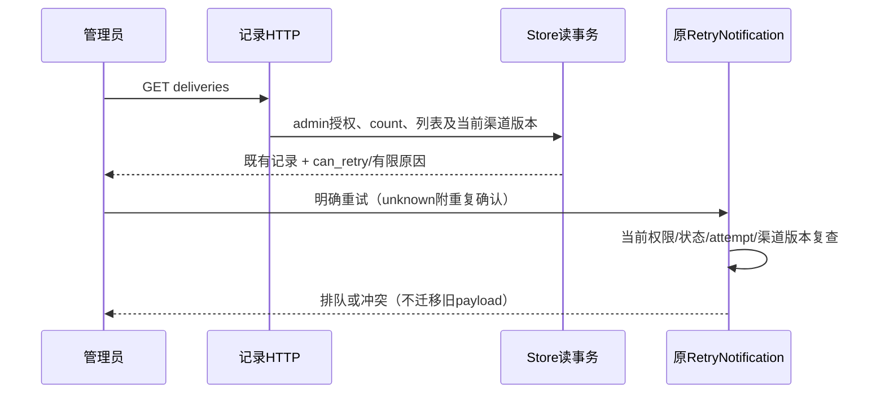

# 通知记录的重试可用状态

## F2 / Workflow Gate

输入：Confirmed REQ-011/014、AC-010/012与落地审计的通知恢复补充。分支codex/sidebar-workflow，P6/P10维护修正。当前记录页仅按failed/unknown及attempt<5开放按钮，但服务端还要求渠道启用、版本一致和attempt>=1。编辑配置后界面显示可重试，服务端固定拒绝。目标是在用户操作之前诚实表达现有恢复边界，不更改恢复权限或把旧消息迁移到新目的地。

Workflow Gate：现有GET /deliveries及POST /deliveries/:id/retry、管理权限、冻结渠道版本、五次尝试上限和unknown重复确认构成上游契约；允许形成这个可用状态投影的设计和F3计划。旧配置事件如何恢复、工单失败恢复、误报解除阻断仍未形成完整契约，继续暂缓，不将这些需求删除或称完成。

Maintainability Gate：notification_records.go 165行，混合记录投影、retry与HTTP，但范围明确；notification-records.tsx仅9行且高度压缩。风险medium；允许narrow_fix，不在全局NotificationDelivery运行对象添加界面状态，新增局部NotificationRecord投影；前端此小文件仅在本次必要修改时整理可读布局，不重排整个integrations页面。无新依赖或DB迁移；关联测试存在。记录列表加入一次LEFT JOIN，不为每条记录单独查渠道/凭据。

## 消费者契约

| 对象/字段 | 类型与规则 | 默认/兼容/所有者 |
| --- | --- | --- |
| NotificationRecord | 嵌入既有NotificationDelivery；仅记录GET使用 | 旧JSON字段保留；Payload/LeaseToken继续json:"-" |
| can_retry | 必须存在的bool | 服务端当前读事务下可请求重试，不承诺最终发送成功 |
| retry_unavailable_reason | 可选有限string | 允许时省略；不包含凭据、目的地址或上游响应 |

字段仅添加到GET /deliveries.items；Store.NotificationRecords的Go返回值调整为[]NotificationRecord，调用方可继续访问嵌入的旧字段。授权/count/列表在同一读事务，LEFT JOIN渠道仅读取id、revision、enabled，不加载credentials。无变更RetryNotification、Claim/Dispatch、lease、payload、历史状态或发送次数。

可请求条件精确对应现有POST前置：status为failed/unknown，attempt为1–4，捕获与当前渠道revision正数且相同，当前渠道存在且enabled。未满足返回有限原因：state_not_retryable、invalid_attempt、attempts_exhausted、configuration_unavailable、configuration_changed、integration_disabled；按状态/次数/配置存在性/版本/启用顺序裁决。unknown的can_retry仍需用户明确重复确认后提交，既有POST继续强制该确认。

界面读取can_retry===true才提供原重试操作；failed/unknown但false时展示具体限制。字段缺失或原因未知时明确“重试可用状态待确认，请刷新记录”，不猜测可重试。配置版本变化说明旧记录不会自动改发到新配置；停用说明当前不能发送，不保证重新启用旧记录（保存配置会增加版本）。达到上限说明五次限制。读取错误不使用旧记录继续操作，保持加载/空/错误/分页。

投影只是观察，不是授权凭据。列表读取后权限/状态/版本变化仍由原POST拒绝；界面遇到409刷新记录并说明已变化，不重新提交，不绕过unknown确认。刷新失败保留错误且不呈现过期记录为当前可操作状态。发送前及之后仍执行既有权限复查，can_retry不能作为可成功投递证明。

验收：同配置failed可请求；unknown无重复确认不能POST成功；修改配置或停用后记录不给出虚假可操作按钮；上限/非法attempt/非重试状态准确；旧响应缺字段关闭操作；投影无凭据与额外副作用；新旧字段序列化及count/分页/权限保持。回滚可移除新投影和界面读取，新旧服务端均不得误把旧payload发往新目的地。修复不等于完整跨配置失败恢复，也不等于整体优化完成。

## F3 实施计划

F2 3d564dc已推。修改notification_records.go：局部记录DTO、列表单查询LEFT JOIN、当前状态投影；保持原RetryNotification与发送队列逻辑。新增notification_retry_availability_test.go，真实临时SQLite验证修改集成name/凭据后revision变化、同配置failed/unknown、disabled、missing配置、attempt边界/终态、列表无副作用、JSON无payload/lease、admin拒绝及分页，保留既有unknown确认/版本冲突测试。修改notification-records.tsx：类型与有限原因解释、仅明确can_retry提供操作、unknown确认、409刷新，保留原loading/empty/error与分页；必要时局部拆可用状态展示组件，便于实际组件渲染验收，不改整个集成页。

先完成专项Go/race及通知事件/owner/access扩大回归，再全Go/vet；frontend typecheck/build与受控组件/浏览器证明同版本、变更配置/停用/上限/unknown确认、缺字段和409刷新。不调用外部渠道、不读取真实凭据；正式前端资源构建与Go嵌入构建串行执行。文档及CHANGELOG随生产提交记录已完成与未完成状态。前版生产HEAD71e4eec精确CI37644666501当前in_progress，新生产push等待该run终态，避免取消其独立验收；不等待虚构进程或以初次列表空为失败。回滚只撤销新观察投影/界面字段消费，保持重试权限与冻结版本边界。

## F4/F5 实施与验证

F3 1c3b94e已推后实施。记录DTO通过单次LEFT JOIN读取当前渠道版本/启用状态，原JSON字段及脱敏保留，不修改runtime DTO、数据库结构或RetryNotification。记录页只在明确can_retry时提供请求；缺字段及未知原因关闭操作，409清除重复确认并重新读取，无自动再次POST。读取失败同时显示错误并隐藏旧记录。仅整理本次两个通知组件，未重排整个集成页面。

真实临时SQLite专项覆盖failed/unknown、真实SaveIntegration改名后的版本冲突、停用、尝试次数边界、终态、损坏历史引用、权限、分页、JSON脱敏和读取不改投递状态。缺失渠道夹具仅在临时单连接Store中短暂关闭外键构造，立即恢复；未改生产外键。初轮测试误用非枚举错误码transport_failed，随后缺失渠道夹具被外键拒绝；修正为provider_http_rejected及上述受控夹具后，TestNotificationRetryAvailabilityCurrentConfiguration通过0.726s，全部TestNotification的race通过36.373s。原unknown重复确认/owner/事件/access测试仍执行且未弱化断言，必要的Go调用方仅解包局部记录DTO。

前端使用既有esbuild/ReactDOM在内存编译实际NotificationRetryControl并渲染可请求、六类拒绝、旧响应缺字段/未知原因（包含constructor）及busy/unknown确认；实际NotificationRecords在受控useResource/api/useState夹具下执行409，验证一次POST、一次刷新、重复确认清除、配置变更不呈现重试、读取错误不呈现旧操作、loading/empty。所有断言通过；这是组件/处理函数验证，不声称真实浏览器端到端或外部通知送达。npm run typecheck、go vet ./...及git diff --check通过。

前一生产71e4eec的CI37644666501已completed/success，允许独立新生产push。初次全Go回归在修正夹具前编译，失败仅来自上述缺失渠道外键夹具；修正后重跑go test ./...全部通过（platform 143.103s）。随后串行npm run build通过（tsc -b及Vite），正式JS为index-DYy66Kuj.js，CSS保持index-RiSjjNhI.css；之后go build ./...通过，正式资源可被嵌入应用。UAR-001/002/004、跨配置通知恢复及全部其余确认需求仍未闭合；没有main合并、部署或整体完成声明。
