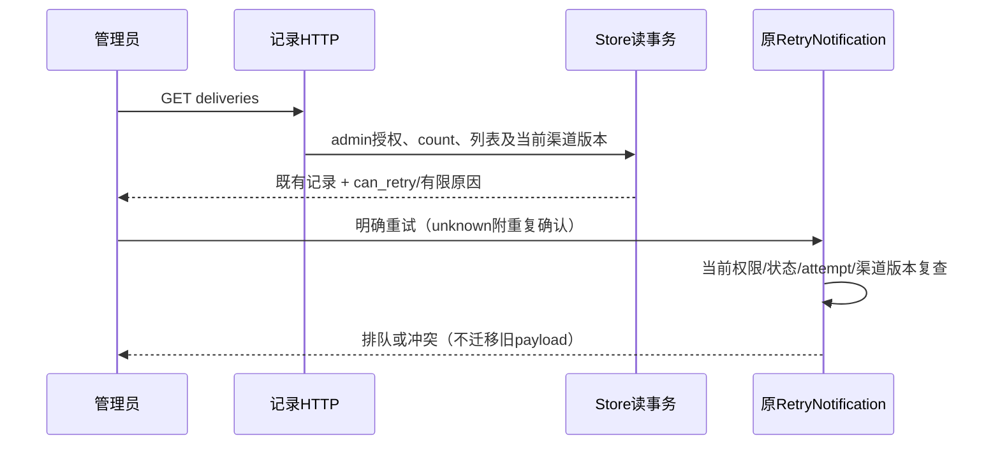

# 通知记录的重试可用状态

## F2 / Workflow Gate

输入：Confirmed REQ-011/014、AC-010/012与落地审计的通知恢复补充。分支codex/sidebar-workflow，P6/P10维护修正。当前记录页仅按failed/unknown及attempt<5开放按钮，但服务端还要求渠道启用、版本一致和attempt>=1。编辑配置后界面显示可重试，服务端固定拒绝。目标是在用户操作之前诚实表达现有恢复边界，不更改恢复权限或把旧消息迁移到新目的地。

Workflow Gate：现有GET /deliveries及POST /deliveries/:id/retry、管理权限、冻结渠道版本、五次尝试上限和unknown重复确认构成上游契约；允许形成这个可用状态投影的设计和F3计划。旧配置事件如何恢复、工单失败恢复、误报解除阻断仍未形成完整契约，继续暂缓，不将这些需求删除或称完成。

Maintainability Gate：notification_records.go 165行，混合记录投影、retry与HTTP，但范围明确；notification-records.tsx仅9行且高度压缩。风险medium；允许narrow_fix，不在全局NotificationDelivery运行对象添加界面状态，新增局部NotificationRecord投影；前端此小文件仅在本次必要修改时整理可读布局，不重排整个integrations页面。无新依赖或DB迁移；关联测试存在。记录列表加入一次LEFT JOIN，不为每条记录单独查渠道/凭据。

## 消费者契约

| 对象/字段 | 类型与规则 | 默认/兼容/所有者 |
| --- | --- | --- |
| NotificationRecord | 嵌入既有NotificationDelivery；仅记录GET使用 | 旧JSON字段保留；Payload/LeaseToken继续json:"-" |
| can_retry | 必须存在的bool | 服务端当前读事务下可请求重试，不承诺最终发送成功 |
| retry_unavailable_reason | 可选有限string | 允许时省略；不包含凭据、目的地址或上游响应 |

字段仅添加到GET /deliveries.items；Store.NotificationRecords的Go返回值调整为[]NotificationRecord，调用方可继续访问嵌入的旧字段。授权/count/列表在同一读事务，LEFT JOIN渠道仅读取id、revision、enabled，不加载credentials。无变更RetryNotification、Claim/Dispatch、lease、payload、历史状态或发送次数。

可请求条件精确对应现有POST前置：status为failed/unknown，attempt为1–4，捕获与当前渠道revision正数且相同，当前渠道存在且enabled。未满足返回有限原因：state_not_retryable、invalid_attempt、attempts_exhausted、configuration_unavailable、configuration_changed、integration_disabled；按状态/次数/配置存在性/版本/启用顺序裁决。unknown的can_retry仍需用户明确重复确认后提交，既有POST继续强制该确认。

界面读取can_retry===true才提供原重试操作；failed/unknown但false时展示具体限制。字段缺失或原因未知时明确“重试可用状态待确认，请刷新记录”，不猜测可重试。配置版本变化说明旧记录不会自动改发到新配置；停用说明当前不能发送，不保证重新启用旧记录（保存配置会增加版本）。达到上限说明五次限制。读取错误不使用旧记录继续操作，保持加载/空/错误/分页。

投影只是观察，不是授权凭据。列表读取后权限/状态/版本变化仍由原POST拒绝；界面遇到409刷新记录并说明已变化，不重新提交，不绕过unknown确认。刷新失败保留错误且不呈现过期记录为当前可操作状态。发送前及之后仍执行既有权限复查，can_retry不能作为可成功投递证明。

验收：同配置failed可请求；unknown无重复确认不能POST成功；修改配置或停用后记录不给出虚假可操作按钮；上限/非法attempt/非重试状态准确；旧响应缺字段关闭操作；投影无凭据与额外副作用；新旧字段序列化及count/分页/权限保持。回滚可移除新投影和界面读取，新旧服务端均不得误把旧payload发往新目的地。修复不等于完整跨配置失败恢复，也不等于整体优化完成。
