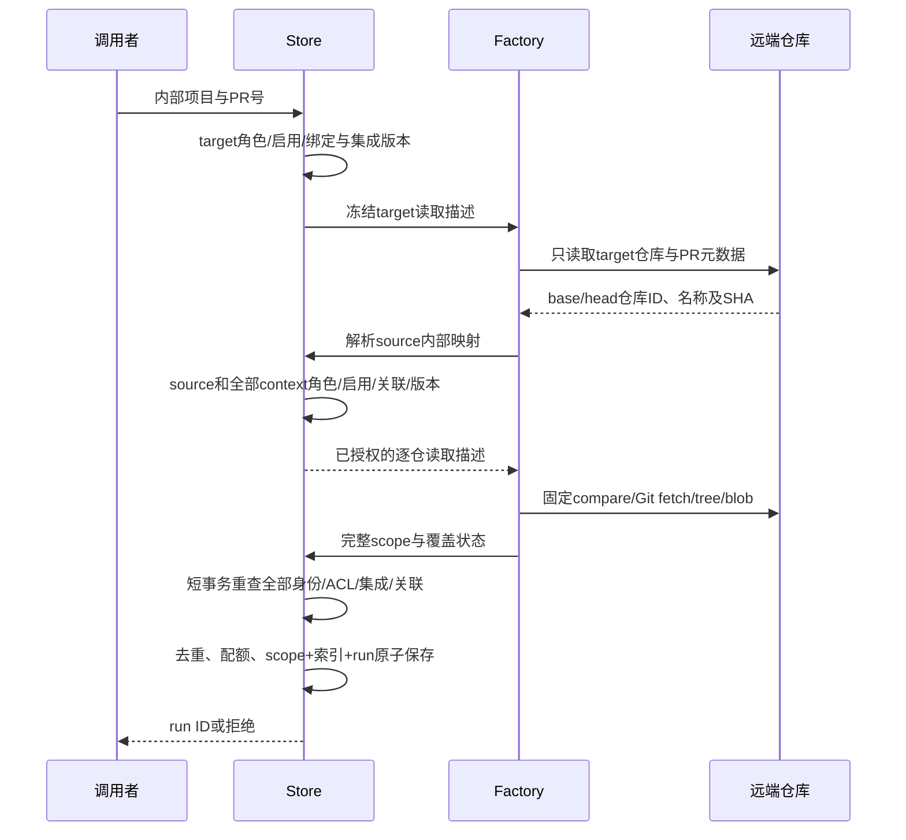

# 仓库身份、历史任务与恢复合同

状态：F2 设计补充，尚未实现或批准进入 F3。输入为 Confirmed requirements.md 的 REQ-007/012/021/023、UAR-001，以及用户“没想清楚先不实现”。不缩减 GitHub 原生审计、跨项目和其余完整需求。

## Workflow Gate / 本次结论

P5–P6 / F2。已具备绑定存储、原生项目创建、配置 outbox、GitHub 固定对象客户端及网络实验；缺完整 factory、冻结多仓身份和恢复迁移。允许写设计，不允许据此直接添加解除绑定接口。前一轮完成当前 head 审计和专项证据，属于 progress；本轮进一步确定恢复不能采用删除绑定后的 legacy fallback。

本文件补充 github-provider-design.md：其中“旧 nil 保持 GitLab”只适用于可证明的旧 legacy 项目，不能成为解除绑定或损坏数据的恢复规则。新运行不得缺少远端身份；历史运行不从当前绑定推断身份。github-diff-design.md 的完整默认 Git 工具链目标保持。

## 已核实的失败机制

1. requireLegacyRepositoryProject 对任何绑定行拒绝执行，公开 PATCH 可以创建该行，没有恢复入口。
2. projectConfiguration 以 binding.Revision!=0 生成 InternalProject；ImportConfiguredProjects 要求 InternalProject 引用仍存在绑定。绑定前的全局 GitLab origin 不在绑定历史中，配置同步也会把旧 legacy 标记替换成内部引用。
3. 原生创建使用 MAX(platform_projects.id)+1，这个内部 ID 与任何 GitLab 远端 ID 无关联。因此删除绑定会使配置导出重新把它写成 legacy 项目，后续执行可能查询同数字的其他 GitLab 仓库。
4. 当前历史任务只冻结 RepositoryURL 和 ProjectID/SourceProjectID，绑定 revision 不在任务快照中。新 provider 不能直接套用该结构。

代码证据：repository_binding_guard.go、project_identity_sync.go 的 projectConfiguration/ImportConfiguredProjects、repository_project_create.go、audit_policy.go、types.go、runs_store.go。不是现有 DELETE 接口的漏洞：接口尚不存在；这是明确否决该恢复方案的设计证据。

## 选定的恢复原则

保留项目内部 ID、ACL、运行和关联历史。恢复是一次显式、带版本的仓库身份配置变更；不删除绑定历史，不将空行解释为默认 GitLab，不重置 revision，不迁移旧任务。管理员明确选定 provider/origin/remote ID/读取集成，受控远端查询确认仓库身份后才可保存可执行映射。即使选回 GitLab，也创建新的显式映射；remote ID 必须明确给出，不能填内部 ID 当默认值。

这解决的是当前项目未来运行的恢复。历史任务是否还能读取由自己的固定身份与当前授权决定，不能借“恢复”自动解除旧任务的保护或复活 unknown 外部动作。损坏行的修复须比较数据库 revision 并追加修复事件，不能删除坏 JSON 掩盖证据；普通读取保持拒绝。

## 拟议数据合同（均未实现）

| 对象 | 字段 / 类型 | 规则与兼容 |
| --- | --- | --- |
| 项目身份登记 | project_id PK；kind=legacy/internal；legacy_origin 可空；legacy_remote_id 可空 | 初次迁移建立；InternalProject 导出依据持久 kind，不依赖绑定行存在。internal 永不自动转 legacy。legacy 的 origin 缺证据时保持未知，不能凭当前设置补猜。 |
| RepositoryBinding | 保持当前 revision/provider/APIOrigin/RemoteID/FullName/IntegrationID | revision 单调增加，删除/停用也不能回到0；既有 JSON/CAS 向前兼容。恢复使用显式新版本，历史记录保留。 |
| AuditPolicy.repository_scope | 可选版本化对象；version=1；target/source/context[] | 新 native 运行必须提供；序列化纳入 policyDigest；不含 token。只扩展 policy，不把 token 存进 runs。 |
| 每个固定身份 | project_id、provider、api_origin、remote_id、full_name、binding_revision、integration_id、integration_revision、commit_sha | 类型分别为正整数/有限 enum/规范 HTTPS/string/完整 SHA；context 单提交；target 冻结 base-tip 与 merge-base 的用途另存 PR observation。两个角色可以引用同一内部项目，但身份元组必须一致。 |
| 绑定可执行状态 | 可用性 + 有限原因 | “配置保存”“远端身份验证”“factory 支持”“实际执行验收”分开；未知不显示可审计。不得仅把 guard 改为放行。 |

身份权威是(provider,api_origin,remote_id)，full_name 是需核对的路由名。不能用 name/URL、公开 fork 或数字 ID 跨平台推断授权。凭据读取仍按冻结集成 revision 校验；更新后的凭据不自动替代旧任务的凭据版本。

项目 kind 初始迁移：现存 binding、原生创建 receipt 或配置 InternalProject 证据任一指向 internal，即不得降级；无绑定的历史 legacy 项目只保留旧路径身份来源，origin 无法证明时不生成历史证明。矛盾证据标记需修复，不自动挑一方。迁移不能因为配置损坏而取消 DB 的内部身份保护。

## 授权与准入顺序

未知 source 只允许发现 target PR 的元数据，不允许 compare、source fetch 或 source tree/blob。origin 必须与目标平台已验证的来源关系一致，不能使用 payload 中任意 clone URL。所有 context 都必须授权完成后才能读内容，不能读取一部分后才发现另一仓无权限。网络不放在 SQLite 写事务里；最终 CAS 失败不产生运行、seen、quota 或 replay 消耗。合法调用的配额保护应在网络前预查，入队再权威复查。

factory 是唯一 provider 选择入口，覆盖 Submit、执行、retry、followup、poll/webhook、context、CODEOWNERS、搜索/读取/目录/历史以及发布 preflight。Repository 工具只收固定描述，不查询当前绑定来改变目标。重试沿用父 scope；“复审最新 PR”是重新准入的新 scope，两者不能互换。

## 生命周期与并发恢复

| 情况 | 行为 |
| --- | --- |
| 保存成功、配置文件同步失败 | DB 和 outbox 已提交；返回已保存/同步待恢复；按新 revision 重读，不以旧版本重复写。 |
| 远端验证过程中管理员改绑定、撤权或换集成 | 保存/入队 CAS 拒绝，零后续内容读取；验证结果不是可长期复用的授权凭据。 |
| 绑定变化时运行 pending/running | 旧快照不可解释为新身份；停止后续读取/发布，并由已有取消机制终止进程；历史结果保留。 |
| 恢复到原远端 identity、但新 revision | 新提交按新版本准入；旧任务仍不因身份名字相同自动续跑。 |
| 项目无可用映射 | disabled/unavailable 可观察；保留 internal 标记；绝不进入 legacy fallback。 |
| 旧任务没有 repository_scope | 仅在原 policy 的 GitLab origin 与原 target/source/context ID 可以证明且满足当前映射/授权时使用兼容 reader；null policy 或矛盾证据不进行远端操作，保留历史结果查看。不能按当前绑定回填 scope。 |
| 回滚到旧二进制 | 已有绑定继续 fail closed；不得删除新增登记/历史/scope以制造兼容。首次执行 native scope 前须设最低支持版本，旧二进制不能把非 nil native policy 当普通 GitLab policy运行。 |

归档/停用与恢复不是同一动作。恢复不能授予成员权限、解除工单/检查 unknown 或标记发现已修复；这些分别有自己的身份与回执合同。

## 验收与后续实施边界

需要真实临时 SQLite 与受控协议证明：legacy→显式绑定→恢复 GitLab、native 创建→失去绑定仍 internal、两平台同数字 ID、历史 scope 未变、CAS 并发、A→B→A 不回到旧 revision、配置文件落后/重启、坏 JSON 与矛盾 receipt、source 未授权零 compare/fetch、context 撤权零内容读取、入队前配置变化零新run/seen/quota/replay、恢复期间进程取消与旧 HEAD 发布拒绝。所有外部 side effect 断言次数/顺序，不仅断言错误码。

现有 project_identity_sync 测试只能证明当前保护，不能证明上述恢复功能已实现。先统一 identity 登记、scope 序列化与 factory 的实现计划；G3 默认 Git 网络隔离/共享预算、API 模式全覆盖和完整消费者仍必须完成。公共恢复 API 和页面字段还需在 F3 前明确，包括错误码、预览/提交 CAS、禁用与损坏配置修复权限；本文件没有授权立即上线新接口。

无需为了恢复增加更多菜单。未来用户操作应在现有仓库配置内明确目标、影响与状态；修改后只有新运行使用新身份。完整功能验收之前不把配置页面交付当可用原生审计。无 main 合并/发布。

## 本轮证据

在 ac57185d5a32df0f42d089e1d72fb8dbbaba7597、macOS/Xcode PATH 执行 `go test ./internal/platform -run 'TestProjectIdentityImportAndContextGuard|TestProjectIdentityConfigurationRecovery|TestProjectIdentityConcurrentImportAndBinding|TestProjectIdentityConcurrentBindingAndExport|TestRepositoryBindingPersistsWithoutLegacyBackfill' -count=1`，exit0，platform1.879s。它证明当前内部引用、导入冲突、同步恢复及并发保护行为，未验收本文件拟议恢复机制。仅修改这两份设计文档；git diff --check 通过。审计报告单独保留，不混入设计提交。
