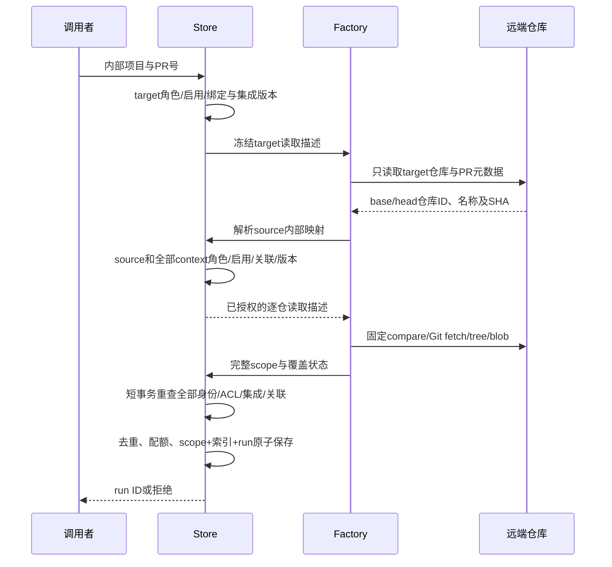
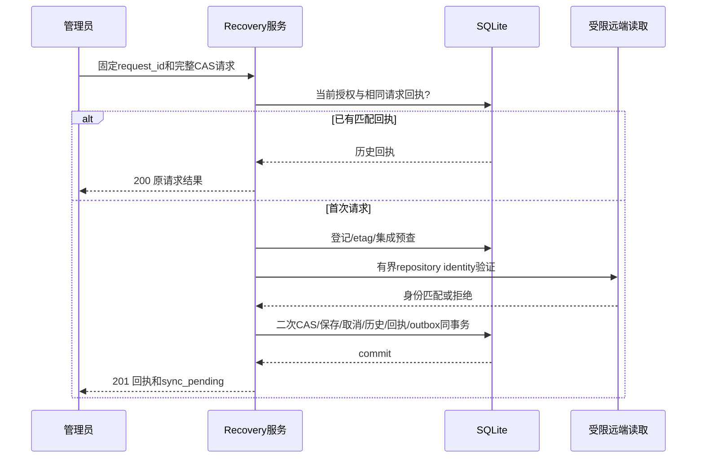

# 仓库身份、历史任务与恢复合同

状态：F2 设计补充，尚未实现或批准进入 F3。输入为 Confirmed requirements.md 的 REQ-007/012/021/023、UAR-001，以及用户“没想清楚先不实现”。不缩减 GitHub 原生审计、跨项目和其余完整需求。

以下初稿由末尾“审查修订合同”补全；发生冲突以修订合同为准。technical-review-2026-10-08-repository-recovery.md 的 Fail 结论仍有效，作者补文不等于审查通过。

## Workflow Gate / 本次结论

P5–P6 / F2。已具备绑定存储、原生项目创建、配置 outbox、GitHub 固定对象客户端及网络实验；缺完整 factory、冻结多仓身份和恢复迁移。允许写设计，不允许据此直接添加解除绑定接口。前一轮完成当前 head 审计和专项证据，属于 progress；本轮进一步确定恢复不能采用删除绑定后的 legacy fallback。

本文件补充 github-provider-design.md：其中“旧 nil 保持 GitLab”只适用于可证明的旧 legacy 项目，不能成为解除绑定或损坏数据的恢复规则。新运行不得缺少远端身份；历史运行不从当前绑定推断身份。github-diff-design.md 的完整默认 Git 工具链目标保持。

## 已核实的失败机制

1. requireLegacyRepositoryProject 对任何绑定行拒绝执行，公开 PATCH 可以创建该行，没有恢复入口。
2. projectConfiguration 以 binding.Revision!=0 生成 InternalProject；ImportConfiguredProjects 要求 InternalProject 引用仍存在绑定。绑定前的全局 GitLab origin 不在绑定历史中，配置同步也会把旧 legacy 标记替换成内部引用。
3. 原生创建使用 MAX(platform_projects.id)+1，这个内部 ID 与任何 GitLab 远端 ID 无关联。因此删除绑定会使配置导出重新把它写成 legacy 项目，后续执行可能查询同数字的其他 GitLab 仓库。
4. 当前历史任务只冻结 RepositoryURL 和 ProjectID/SourceProjectID，绑定 revision 不在任务快照中。新 provider 不能直接套用该结构。

代码证据：repository_binding_guard.go、project_identity_sync.go 的 projectConfiguration/ImportConfiguredProjects、repository_project_create.go、audit_policy.go、types.go、runs_store.go。不是现有 DELETE 接口的漏洞：接口尚不存在；这是明确否决该恢复方案的设计证据。

## 选定的恢复原则

保留项目内部 ID、ACL、运行和关联历史。恢复是一次显式、带版本的仓库身份配置变更；不删除绑定历史，不将空行解释为默认 GitLab，不重置 revision，不迁移旧任务。管理员明确选定 provider/origin/remote ID/读取集成，受控远端查询确认仓库身份后才可保存可执行映射。即使选回 GitLab，也创建新的显式映射；remote ID 必须明确给出，不能填内部 ID 当默认值。

这解决的是当前项目未来运行的恢复。历史任务是否还能读取由自己的固定身份与当前授权决定，不能借“恢复”自动解除旧任务的保护或复活 unknown 外部动作。损坏行的修复须比较数据库 revision 并追加修复事件，不能删除坏 JSON 掩盖证据；普通读取保持拒绝。

## 拟议数据合同（均未实现）

| 对象 | 字段 / 类型 | 规则与兼容 |
| --- | --- | --- |
| 项目身份登记 | project_id PK；kind=legacy/internal；legacy_origin 可空；legacy_remote_id 可空 | 初次迁移建立；InternalProject 导出依据持久 kind，不依赖绑定行存在。internal 永不自动转 legacy。legacy 的 origin 缺证据时保持未知，不能凭当前设置补猜。 |
| RepositoryBinding | 保持当前 revision/provider/APIOrigin/RemoteID/FullName/IntegrationID | revision 单调增加，删除/停用也不能回到0；既有 JSON/CAS 向前兼容。恢复使用显式新版本，历史记录保留。 |
| AuditPolicy.repository_scope | 可选版本化对象；version=1；target/source/context[] | 新 native 运行必须提供；序列化纳入 policyDigest；不含 token。只扩展 policy，不把 token 存进 runs。 |
| 每个固定身份 | project_id、provider、api_origin、remote_id、full_name、binding_revision、integration_id、integration_revision、commit_sha | 类型分别为正整数/有限 enum/规范 HTTPS/string/完整 SHA；context 单提交；target 冻结 base-tip 与 merge-base 的用途另存 PR observation。两个角色可以引用同一内部项目，但身份元组必须一致。 |
| 绑定可执行状态 | 可用性 + 有限原因 | “配置保存”“远端身份验证”“factory 支持”“实际执行验收”分开；未知不显示可审计。不得仅把 guard 改为放行。 |

身份权威是(provider,api_origin,remote_id)，full_name 是需核对的路由名。不能用 name/URL、公开 fork 或数字 ID 跨平台推断授权。凭据读取仍按冻结集成 revision 校验；更新后的凭据不自动替代旧任务的凭据版本。

项目 kind 初始迁移：现存 binding、原生创建 receipt 或配置 InternalProject 证据任一指向 internal，即不得降级；无绑定的历史 legacy 项目只保留旧路径身份来源，origin 无法证明时不生成历史证明。矛盾证据标记需修复，不自动挑一方。迁移不能因为配置损坏而取消 DB 的内部身份保护。

## 授权与准入顺序

未知 source 只允许发现 target PR 的元数据，不允许 compare、source fetch 或 source tree/blob。origin 必须与目标平台已验证的来源关系一致，不能使用 payload 中任意 clone URL。所有 context 都必须授权完成后才能读内容，不能读取一部分后才发现另一仓无权限。网络不放在 SQLite 写事务里；最终 CAS 失败不产生运行、seen、quota 或 replay 消耗。合法调用的配额保护应在网络前预查，入队再权威复查。

factory 是唯一 provider 选择入口，覆盖 Submit、执行、retry、followup、poll/webhook、context、CODEOWNERS、搜索/读取/目录/历史以及发布 preflight。Repository 工具只收固定描述，不查询当前绑定来改变目标。重试沿用父 scope；“复审最新 PR”是重新准入的新 scope，两者不能互换。

## 生命周期与并发恢复

| 情况 | 行为 |
| --- | --- |
| 保存成功、配置文件同步失败 | DB 和 outbox 已提交；返回已保存/同步待恢复；按新 revision 重读，不以旧版本重复写。 |
| 远端验证过程中管理员改绑定、撤权或换集成 | 保存/入队 CAS 拒绝，零后续内容读取；验证结果不是可长期复用的授权凭据。 |
| 绑定变化时运行 pending/running | 旧快照不可解释为新身份；停止后续读取/发布，并由已有取消机制终止进程；历史结果保留。 |
| 恢复到原远端 identity、但新 revision | 新提交按新版本准入；旧任务仍不因身份名字相同自动续跑。 |
| 项目无可用映射 | disabled/unavailable 可观察；保留 internal 标记；绝不进入 legacy fallback。 |
| 旧任务没有 repository_scope | 仅在原 policy 的 GitLab origin 与原 target/source/context ID 可以证明且满足当前映射/授权时使用兼容 reader；null policy 或矛盾证据不进行远端操作，保留历史结果查看。不能按当前绑定回填 scope。 |
| 回滚到旧二进制 | 已有绑定继续 fail closed；不得删除新增登记/历史/scope以制造兼容。首次执行 native scope 前须设最低支持版本，旧二进制不能把非 nil native policy 当普通 GitLab policy运行。 |

归档/停用与恢复不是同一动作。恢复不能授予成员权限、解除工单/检查 unknown 或标记发现已修复；这些分别有自己的身份与回执合同。

## 验收与后续实施边界

需要真实临时 SQLite 与受控协议证明：legacy→显式绑定→恢复 GitLab、native 创建→失去绑定仍 internal、两平台同数字 ID、历史 scope 未变、CAS 并发、A→B→A 不回到旧 revision、配置文件落后/重启、坏 JSON 与矛盾 receipt、source 未授权零 compare/fetch、context 撤权零内容读取、入队前配置变化零新run/seen/quota/replay、恢复期间进程取消与旧 HEAD 发布拒绝。所有外部 side effect 断言次数/顺序，不仅断言错误码。

现有 project_identity_sync 测试只能证明当前保护，不能证明上述恢复功能已实现。先统一 identity 登记、scope 序列化与 factory 的实现计划；G3 默认 Git 网络隔离/共享预算、API 模式全覆盖和完整消费者仍必须完成。公共恢复 API 和页面字段还需在 F3 前明确，包括错误码、预览/提交 CAS、禁用与损坏配置修复权限；本文件没有授权立即上线新接口。

无需为了恢复增加更多菜单。未来用户操作应在现有仓库配置内明确目标、影响与状态；修改后只有新运行使用新身份。完整功能验收之前不把配置页面交付当可用原生审计。无 main 合并/发布。

## 本轮证据

在 ac57185d5a32df0f42d089e1d72fb8dbbaba7597、macOS/Xcode PATH 执行 `go test ./internal/platform -run 'TestProjectIdentityImportAndContextGuard|TestProjectIdentityConfigurationRecovery|TestProjectIdentityConcurrentImportAndBinding|TestProjectIdentityConcurrentBindingAndExport|TestRepositoryBindingPersistsWithoutLegacyBackfill' -count=1`，exit0，platform1.879s。它证明当前内部引用、导入冲突、同步恢复及并发保护行为，未验收本文件拟议恢复机制。仅修改这两份设计文档；git diff --check 通过。审计报告单独保留，不混入设计提交。

## 审查修订合同（2026-10-08，拟议，未实现）

### RRC-001：持久身份与快照只有一个权威来源

新增 `platform_repository_identities`：project_id INTEGER PK/FK；kind TEXT NOT NULL CHECK legacy/internal；revision INTEGER NOT NULL CHECK>0；health TEXT NOT NULL CHECK valid/repair_required；created_at/updated_at TEXT NOT NULL。没有默认 kind，不能靠缺行推断 legacy。revision 是项目身份登记的代次，所有修改者使用同一事务 CAS；保留绑定表和历史表，binding revision 表示配置版本。没有自动删除/过期，项目停用也保留登记。原稿 legacy_origin/legacy_remote_id 不作为登记字段：origin 属于具体运行的固定描述，迁移不能制造不存在的旧 origin 证据。

迁移在启动设置导入之前的单一事务完成：绑定当前行、绑定历史行、原生创建 receipt 任一存在则登记 internal（不解析坏 JSON 来决定 kind）；无这些 DB 证据的已有项目登记 legacy。绑定 current/history 的结构、版本或 receipt 互相矛盾时 health=repair_required；原生 receipt 存在但绑定缺行同样 repair_required。配置 InternalProject 只能验证 DB 登记，不能新建/降级 DB 身份；仅配置声称 internal 而 DB 无证据时导入明确冲突。历史 legacy 任务不用于改变 kind。迁移不修改任务 JSON、ACL或配置文件；outbox 在该事务标 dirty，配置导出根据登记 kind生成 InternalProject，不根据有无绑定生成。

新建 legacy 项目同事务登记 legacy/revision1；原生创建同事务登记 internal/revision1，且保存绑定与 receipt；首次显式绑定将 legacy 转 internal 并递增登记 revision。之后 kind 只允许 internal，不存在 internal→legacy。配置/修复更新递增登记 revision 与绑定 revision；MAX_INT64、负数、登记缺失/损坏不能通过普通路径复位，返回 offline_repair_required。保留所有旧 history，修复新增 revision 必须大于登记、当前绑定列和全部历史 revision 的最大有效正数；无有效界限或溢出拒绝在线修复。history 中损坏记录保留并记录修复 event，不成为新版本授权依据。

`AuditPolicy.repository_scope` 使用以下精确结构；所有字段必填，标注可选的例外除外。producer 构造后统一规范化校验，consumer 不容忍缺失、未知 version、重复 JSON key 或不一致字段。scope JSON上限16KiB；context最多4个，与当前 normalizeContextRepositories 一致。

| 对象 / 字段 | 类型、校验、默认与所有者 |
| --- | --- |
| scope.version | integer，恰为1；无默认，Store校验 |
| scope.target / source | RepositoryReference，各一个；无默认，factory构造 |
| scope.context | ContextReference数组，必须存在，可空；按 project_id 严格升序且唯一，最多4项，不含target |
| scope.observation | provider、number、base_tip_sha、merge_base_sha、head_sha；number正且等于Snapshot.MRIID；SHA小写完整合法ID，GitHub只接受40hex；provider等于target/source，origin同平台边界 |
| RepositoryReference | project_id正且等于Snapshot对应ID；identity_revision正；provider github/gitlab；api_origin规范HTTPS；remote_id正int64；full_name复用binding校验；binding_revision见下；credential见下；不存URL/token |
| ContextReference | repository:RepositoryReference，sha:完整小写SHA；可与source同内部项目，元组必须完全一致；允许context跨平台/跨origin，不把target平台限制套到context |
| credential.kind=integration | integration_id/revision正int64且必填；对应binding_revision正；kind、origin、scope、启用都核对 |
| credential.kind=legacy_gitlab | legacy_repository_revision正uint64且必填；不得同时出现integration字段；仅gitlab且登记legacy；binding_revision=0，remote_id等于该legacy项目ID并通过本次远端读取核实，不用于证明旧任务 |

同仓PR的target/source引用必须完全相同，不含角色特定SHA；提交用途只放在 observation，避免一个reference.commit_sha同时代表base-tip、merge-base、HEAD。Snapshot.BaseSHA等于merge_base_sha，HeadSHA等于head_sha；GitLab原DiffVersionID继续由固定版本读取器验证，GitHub不伪造GitLab版本号。target/source不能跨provider/origin，但context可以。full_name用于路由，远端ID核对保持权威；改名不会自动修改历史reference。

混合legacy与显式仓库使用逐仓credential联合类型，不共享token。新增Settings.LegacyRepositoryRevision（持久uint64，默认旧配置首次升级为1），仅当GitLab origin/token及其网络授权配置改变时递增，模型/项目名称/配置outbox同步不递增；比较秘密仅在服务端内存，不输出hash/token。缺失、回退、溢出拒绝新运行；Settings更新CAS与写文件成功之后才换内存快照。新scope legacy描述只与当前这一generation匹配；旧无scope任务继续现有冻结RepositoryURL兼容路径，不伪造generation，旧policy=null或legacy导入缺SHA只可查看历史结果。此新代次需要settings_revision测试证明重启、凭据变更、非凭据保存和并发，不能复用全局Revision冒充专用代次。

旧 AuditPolicy.ContextRepositories 保留，必须恰好等于scope.context的(project_id,sha)投影；空数组规范为[]。入队在一个事务内校验Scope与Snapshot、全部ACL/关联/配置代次，保存policyJSON/digest/run/context索引，索引仍使用原表。同一run加载/发布/读取必须核对scope.context、旧policy.context和索引三者一致；不一致拒绝远端操作，历史结果展示注明不完整。retry复制父JSON及原索引并验证一致；followup深拷贝scope，仅改变FollowupOf/SelectedFiles，不能共享可变slice/map或重新抓当前PR。snapshotForRun须读取base/head/mr/diffVersion用于完整校验，不能把当前残缺Snapshot作为校验输入。最新PR复审重新准入并创建新scope。

### RRC-002：诊断、修复与响应丢失恢复

新增admin专属 `GET /projects/:id/repository-recovery`，在同一读事务授权并返回 `{state, identity_revision, binding_revision?, evidence_etag?, current?:validBinding, can_recover, reason?}`。state有限为 valid/repair_required/offline_repair_required；current只在原binding完整合法时提供。坏JSON/原始列/provider响应/凭据不返回。evidence_etag为规范类型带长度的当前登记/绑定列与原始bindingJSON/历史高水位摘要的SHA256；读、CAS都在事务内重新计算，不能只比较JSON内revision。单个损坏bindingJSON超过64KiB或登记/历史revision无法建立安全上界时can_recover=false、offline_repair_required，转离线维护，不假称所有物理损坏可在线修复。

新增admin专属 `POST /projects/:id/repository-recovery`，body最多8KiB：request_id(UUID)、expected_identity_revision(正)、evidence_etag(64hex)、expected_integration_revision(正)、provider/api_origin/remote_id/full_name/integration_id（同binding验证）、reason(UTF8、1–1000bytes，人工说明)。严格拒绝未知/重复key、空值与尾随JSON。只能输出显式integration新绑定，不能用本接口切回legacy或使用全局token。停用项目也可修复配置，但保持项目停用；不恢复运行、不创建ACL。账号必须全局admin且未停用，CSRF/origin同现有写路由。

流程：本地规范化→短事务查已存回执→未存则诊断CAS预查、集成scope与revision/网络授权→事务外readonly远端repository验证（target identity、15秒总deadline，无compare/PR内容、重定向或任意payloadURL）→短事务再次admin/项目/登记/etag/集成/唯一remote身份验证→保存新绑定/登记revision/历史/取消/event/回执/outbox→commit→尽力通知取消并同步配置。只有验证完成且factory支持的provider可以提交；factory不可用503，零验证请求、零DB变化。修复不是先存unavailable再补验证。

新增 `platform_repository_recovery_receipts`：actor/request_id联合PK；project_id FK；digest TEXT64hex；receipt_json TEXT（<=16KiB）；created_at必填；不自动删除。digest包含规范请求所有字段，不含token；actor不来自body。相同actor/key/digest重放在当前admin、项目存在校验后返回原回执，不再次远端验证/写revision/取消；不同请求同key409。同事务回执不被后续配置变更覆盖，UI必须区分“原请求回执”和“当前配置”；显示当前state须另GET。重放可尽力SyncProjectConfig，不能发通知或新审计。

响应：首次201、重放200，body `{project_id,request_id,repository,identity_revision,replayed,sync_pending}`。DB已提交但配置同步失败仍返回上述回执、sync_pending=true；不把成功提交伪装失败。网络断开没有收到回执：客户端保持完整请求/key冻结并重放；不能换key自动提交。状态400 invalid_input；401/403既有权限；404项目不存在；409 recovery_conflict/request_conflict/identity_conflict；422 remote_identity_mismatch；503 provider_unavailable/verification_unavailable/offline_repair_required。只输出有限code，429受控限流包含合法Retry-After，不暴露上游body；失败且无回执不改配置/历史/outbox/运行。重放处理优先于expected当前revision，避免响应丢失后被自己的提交冲突锁死。

### RRC-003：并发与取消的可验证边界

替代原稿“绑定变化即零后续内容读取”的笼统承诺。一个已派发的远端请求可能在撤权提交后完成，不能撤回已发送请求或已读字节。保证是：每个操作派发前短事务复查当前run lease/status、scope配置代次与全仓ACL；操作完成后、进入工具结果/模型输入/审计checkpoint/发布前再复查。任一观察到失配即丢弃结果并终止操作，不派发下一请求。多请求树/搜索/fetch阶段逐次检查，不仅整个审计前查一次；缓存命中也复查授权，缓存不是旁路。

恢复提交事务取消所有pending/running且target/source/context索引含该项目的run，并记录repository_identity_changed；pending不会生成重试，正在运行的结果写入仍由status/lease fence拒绝。revision变更即取消，即使remote tuple没变。配置写成功后调用Runner的批量进程cancel，不把取消调用放在DB事务里；另一连接/实例通过现有5秒heartbeat观察取消，这是观察周期而非硬实时终止承诺。HTTP调用继承run context，Git子进程继承同context并验证cancel后退出和临时目录清理；请求/命令deadline为最终资源上限。

source/context撤权使用同样前后检查；没有持久run的准入阶段检查全部冻结描述和角色。已发出的identity验证可完成，但CAS失配不能保存/入队，其结果不得用来继续compare/fetch。测试断言已发请求次数、结果未消费、下一请求数为0，不把已发请求算成不存在。阻断/工单/通知各自保留已发生外部动作的unknown/readback规则，不能用后置ACL失败声称外部动作没发生。

### RRC-004：升级与降级屏障

选定DB schema2作为持久格式屏障，PolicyVersion独立升级为后续版本（F3确定唯一常量名，不复用v50）。新Store启动在任何迁移/导入/worker启动之前读取schema版本，支持1→2迁移和已为2；其他版本拒绝。首次新建直接2；1→2单事务完成登记/回执schema、完整性检查、dirty outbox、最后schema version=2，失败全回滚。现有旧Store只接受1且在commit前拒绝其他版本，故schema2不能被它成功OpenStore；必须用238ef1d真实旧二进制验证，不能仅构造新版decoder。

发布顺序：停止全部旧worker/HTTP admission，取得SQLite一致备份及配置备份并核实无旧进程/租约活动，再运行升级；schema2提交后才启用新worker，factory未完成仍禁止native操作。不可滚动混用同DB：已打开的旧连接不会因version行变化自动停止，修改version不能替代停机。设置新增专用凭据代次随同新程序管理，旧程序也不得并发写配置。

新policy运行新建/重试/发布都校验支持scope version；schema屏障覆盖打开、导入与配置同步，policy屏障覆盖任务执行。旧无scope结果可读；符合原身份证据的legacy固定读取只能走显式compat reader；旧pending/running在升级前停止并保留失败/中断证据，不能自动把旧任务改为新policy或scope，授权用户重新提交。独立CLI若不使用平台DB/项目不受schema版本影响，但不得共享升级服务配置写入。

升级后的程序回滚只用支持schema2的版本。降回旧版必须停止新程序并恢复升级前配套DB+配置备份，明确会放弃备份后的新记录；禁止改version=1或删scope/identity表来强行打开。此离线回滚需运维明确选择，不是产品自动恢复；未验证备份恢复前禁止发布升级。

### 后续交接与验证要求

该修订替代初稿的含糊字段、无恢复接口和即时取消承诺。它不批准实现；RRC-001–004需重新审查。F3必须按登记/schema屏障、scope/索引对账、逐仓factory、恢复服务/回执/取消、现有编辑页集成拆文件，并列出完整Git/API模式的依赖，不先上线半条链路。新增字段的producer→JSON→旧/新consumer→文档→实际测试全链路校验必需。

必须新增的区分性证据：各字段缺失/重复/跨字段矛盾、SHA用途、4个context/超限与跨平台、mixed legacy/integration逐token隔离、无关设置不改变专用代次、坏JSON诊断不回显与修复、revision最大值/历史冲突/64KiB上限、请求响应丢失/同key不同body/修复后改绑再重放、验证中撤权零后续请求、结果返回后失权不进模型、同/跨连接run取消、schema1迁移原子失败、真实旧版拒绝schema2、旧版已经打开时升级被运维前置阻止、备份恢复证明。现有专项通过不代替这些新验证。

修订验证：在8ce97b4454986f9bcf604f71f5fe599250f7b927的实际v50 platform.Store代码编译隔离探针，创建临时SQLite、将platform_schema设为2、加入sentinel；再次OpenStore固定拒绝unsupported platform schema 2。拒绝前后sqlite_master结构完整一致，version仍2、sentinel保留，exit0。238ef1d→该HEAD只有审查文档，Store代码未变；这证明现有Store拒绝事务不提交，不声称完整旧服务进程/新迁移/已打开连接并发被验收。初次含rm清理的命令被工具拒绝、未执行，随后改用Python TemporaryDirectory管理自身临时目录并成功；探针/DB全部清理，生产源码无变更。运行显示现有sonic对当前Go/架构fallback到encoding/json警告，探针仍正常通过；没有为消除警告更改依赖。git diff --check通过。

## RRC-005/006修订：回执归属与凭据激活（拟议，未实施）

以下替代上文相冲突的规则，仍需正式复审；technical-review-2026-10-08-repository-recovery-2.md的Fail不会因作者补文自动失效。

### 回执摘要绑定路由项目

恢复digest的唯一输入为固定Go struct的规范JSON：`{version:1,actor:当前授权账号ID,project_id:解析后的URL项目ID,request:规范RecoveryRequest}`。struct字段顺序固定，禁止map编码；request_id小写UUID，origin复用规范化，reason保留原UTF8字节、不静默trim。CAS相关整数必须完整解析，禁止浮点转换。请求摘要不是仅body摘要。回执联合PK仍actor/request_id；同key跨project即request_conflict，不能返回其他项目回执。

回执重放前严格校验：当前admin/项目存在；表actor/project_id/request_id/digest与请求一致；receipt.project_id/request_id一致；receipt.repository是合法canonical binding且revision正；receipt.identity_revision正且等于回执保存值；stored replayed=false；拒绝未知字段、重复key、缺字段、尾随JSON或大于16KiB。回执保存新增identity_revision INTEGER NOT NULL CHECK>0，以便独立列/JSON一致性校验。回执内repository允许与项目当前配置不同，但必须与该revision的有效历史绑定完全一致；该历史行缺失/损坏/不同，返回503 recovery_receipt_unavailable，不把异常当无回执重新提交。reason不回显、不进入模型/远端，event仅记录有限操作身份和版本，避免将人工输入误当日志指令。

尚未提交过的失败请求不占成功回执，明确提交后断网必须同body/key重放。UI始终使用整数精确值：新identity revision/CAS字段用十进制字符串传输（无符号、无前导零，范围1..MAX_INT64），response和receipt匹配同格式；旧Binding/Integration number字段保留现有协议，浏览器先Number.isSafeInteger，否则拒绝操作并说明需要精确API客户端。scope在Go/DB内完整整数，UI不得回传已舍入的revision。需要验证超2^53值不会授权错误CAS。

### 凭据代次不来自Settings输入

撤销上文新增Settings.LegacyRepositoryRevision字段的方案。新scope的credential.legacy_repository_revision改为数据库管理的正int64；JSON使用精确十进制字符串，与新CAS规则一致。Settings前端、YAML及HTTP不接受/保存此counter；实际token仍由现有Settings服务管理。更改旧配置文件也不能选择历史代次。

新增 `platform_legacy_repository_state` 单例表：id INTEGER PK CHECK=1；generation INTEGER NOT NULL DEFAULT0 CHECK>=0；hmac_key BLOB NOT NULL CHECK length=32；fingerprint BLOB NULL CHECK length=32；updated_at TEXT NOT NULL。迁移创建crypto/rand32byte key、generation0/fingerprint NULL，在首次有效配置激活前拒绝legacy scope准入。fingerprint非NULL时generation必须正；generation>0但fingerprint缺失、行缺失、多行、非法key/列类型均offline_repair_required，不重新生成key或counter。达到MAX_INT64只允许未变配置，改凭据拒绝。密钥/指纹只由Store私有方法访问，绝不在HTTP/模型/日志/event/policy返回；数据库现有0600权限及配套备份要求继续生效。不新建原token副本。

指纹输入为服务端构造的有版本规范元组：canonical GitLab origin、原token精确bytes、factory实际生效的规范网络授权CIDR列表及transport policy version。CIDR按canonical字符串排序去重；不含模型/项目名称/通知配置。HMAC-SHA256使用持久key；禁止用裸token hash做可公开标识。origin/token/网络/transport策略实际改变都递增generation。单写事务BEGIN IMMEDIATE内读取当前state、比较HMAC、同值保持、异值递增并更新；token相同但counter不回退，A→B→A必须1→2→3。并发同配置只递增一次；不把32byte指纹相同解释成不同项目的ACL等同。

### 激活状态机与跨文件/DB失败

模块责任：SettingsService负责配置文件与有效内存快照；新增RepositoryCredentialActivation负责legacy activation gate和规范指纹；Store负责持久state。激活器在HTTP/admission/worker启动前绑定到Settings服务。Settings.save的仓库配置变更必须经同一hook，项目outbox同步与纯模型修改不旋转generation。锁顺序Settings写锁→activation gate→短Store事务；Store不得持有事务回调Settings，避免反向锁死。HTTP读取不在DB写事务持锁；runtime只能拿已激活不可变descriptor，不能自动登记新generation。

| 触发/阶段 | 持久与内存行为 | 对外行为 |
| --- | --- | --- |
| 启动 | 先读校验配置与DBstate，按有效指纹完成激活，再启动worker | 未激活不接受legacy准入；旧无scope兼容reader也经过gate |
| 仓库配置Save开始 | activation_pending=true，禁止legacy新操作；旧运行进入取消/结果消费fence | 当前已发请求遵守RRC-003，不承诺撤回 |
| 写配置文件失败 | DBstate/有效内存保持旧值；确认无持久变化后清pending | 原Save失败，旧凭据仍可用；未知持久结果不能直接清pending |
| 文件成功、DB更新失败 | 保留pending；有效内存不得宣布新凭据active；文件不可假称未保存 | 返回固定credential_activation_pending；原文件/代次状态需恢复，不自动回写旧文件 |
| DB成功、内存发布前 | DB新state已提交，pending仍true；原legacy描述被generation fence拒绝 | 不允许窗口内创建任务 |
| 内存发布成功 | 发布immutable config+generation，清pending；取消含旧legacy scope的pending/running run | 新运行可用；旧scope不得继承新generation |
| 中断/重启 | 从真实文件重算指纹，与已提交DB比较；同值不重复递增，异值生成新代次 | 完成恢复后才启动worker；旧scope继续被拒绝 |
| 文件恢复旧token | 按新激活递增，即使token过去出现过 | 不返回过去的generation，不复活旧运行 |

Save返回的同步pending不同于仓库activation_pending：项目outbox只影响配置列表同步，凭据activation未完成则核心legacy读取不可用。同进程恢复允许显式重新加载当前已落盘有效配置、重新完成激活；读取/校验失败保持pending。该操作重用同一激活器，不提供“手填generation”或自动覆盖配置的按钮。进程重启路径同样验证，不依赖client重放来恢复DB版本。其HTTP诊断只公开active/pending/unavailable及有限code，不返回HMAC/秘密。config修改过程中也会改变model字段时，整个Settings内存快照在激活完成后一次发布，避免半个配置生效。

runtime每次legacy操作前后核对：activation非pending、当前有效配置HMAC与DBfingerprint匹配、scope generation与DBgeneration匹配、全部ACL/lease/身份仍合法。只比较DBcounter不够；只比较内存token也不够。cache结果也走同一检查。直接编辑YAML在明确reload/启动前不属于当前有效内存配置；reload后当新激活处理，不相信文件自称旧版本。DB与配置同时恢复升级前备份会丢失之后的状态，按RRC-004离线回滚规则处理，不称无损恢复。

### 本轮证据与剩余门禁

credential-generation-evidence.md记录9个合成SQLite场景通过，支持上述持久generation候选；不证明activation gate、Go锁顺序、Settings.save hook或runtime消费者已完成。后续必须通过实际Go双连接/配置故障/中断/模型输入次数/取消及精确序列化测试，再开放恢复或native scope。原G3默认Git/共享预算/API模式/所有消费者前置继续保留。此次是F2作者修订，没有F3或生产实施许可。
